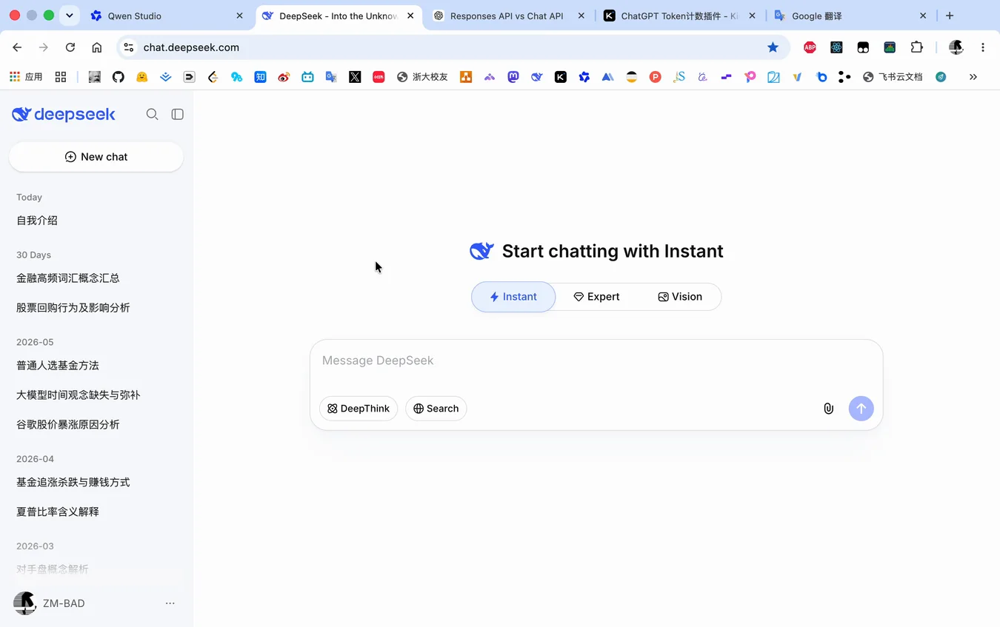

# Headroom

> Know when your AI is about to forget.

**English** | [简体中文](./README_zh.md)

**Headroom** is a browser extension that shows you how much context window you have left in AI chat conversations — before your AI silently starts losing important details.

## The Problem

When you're deep in a long conversation with an AI (DeepSeek, Gemini, ChatGPT...), you've probably experienced this:

- The AI forgets a constraint you mentioned 10 rounds ago
- It starts contradicting earlier parts of the conversation
- Output quality degrades silently, and you don't know why

This happens because **context windows have limits**, and when they fill up, the AI quietly drops earlier information. None of the major AI chat platforms show you how much context room you have left.

## The Solution

Headroom sits in your browser's native side panel and gives you a real-time, visual indicator of your context window usage:

- 🟢 **Green** — Plenty of room, keep chatting
- 🟠 **Yellow** — Starting to fill up, be mindful
- 🔴 **Red** — Almost full, consider starting a new conversation

Thresholds are customizable, and the extension auto-detects which AI platform you're on to match the correct context window limit (you can override it per platform).



### Highlights

- **Zero setup** — No account, no API key, no configuration. Install and it just works.
- **7 platforms** — DeepSeek, ChatGPT, Gemini, Kimi, Qwen, 通义千问, and 豆包 (Doubao).
- **Real-time gauge** — Watch your context window fill up as you chat. Color-coded green / yellow / red thresholds show you exactly when to start a new conversation.
- **Per-round breakdown** — See estimated token counts for every Q&A pair, including input and output separately.
- **Privacy by design** — Conversation text is read transiently to count tokens, then discarded. Only the token counts are stored, locally and optionally in your own cloud storage. No Headroom server exists.

## Who Is This For

**Professionals who use AI chat as part of their daily workflow** — developers, researchers, writers, analysts.

If you spend significant time in AI chat interfaces for architecture discussions, code reviews, research deep-dives, or technical writing, Headroom helps you maintain conversation quality by knowing exactly when context is running out.

This is **not** a token cost calculator. AI models are getting cheaper by the month — cost is not the concern. The concern is **context quality**: making sure your AI hasn't silently forgotten something critical.

## How It Works

1. **Install the extension** in Chrome, Edge, or Firefox
2. **Open the side panel** on any supported AI chat platform — Headroom reads the conversation history and estimates your token usage
3. **Watch the gauge** — as you chat, the indicator shows you how much context room remains

The extension works entirely offline. It reads conversation text from the page to count tokens, then keeps only the counts.

## Browser Support

Headroom is **Manifest V3 only** (MV2 is not supported) and requires a recent browser version:

| Browser        | Minimum Version |
| -------------- | --------------- |
| Google Chrome  | ≥ 149           |
| Microsoft Edge | ≥ 149           |
| Firefox        | ≥ 151           |

### Known Platform Differences

| Behavior                                      | Chrome | Edge                     | Firefox                            |
| --------------------------------------------- | ------ | ------------------------ | ---------------------------------- |
| Icon grays on non-AI pages                    | ✅     | ✅                       | ✅                                 |
| Panel auto-closes when leaving AI page        | ✅     | ✅                       | ❌ (content switches to hint page) |
| Panel auto-restores when returning to AI page | ✅     | ❌ (manual click needed) | ✅ (content restores)              |

**Edge limitation:** `sidePanel.setOptions({ enabled: true })` does not auto-restore the panel after switching back to an AI platform tab. Microsoft confirmed this is "by design" ([issue #222](https://github.com/microsoft/MicrosoftEdge-Extensions/issues/222), open since Nov 2024, no fix). Workaround: click the toolbar icon to reopen.

**Firefox limitation:** `sidebarAction.close()` requires a user gesture and cannot be called on tab switch (Firefox platform limit). The sidebar must be manually closed by the user. When switching to a non-AI page, the sidebar content switches to a hint page via `sidebarAction.setPanel()`.

## Supported Platforms

| Platform      | Context (default) |
| ------------- | ----------------- |
| DeepSeek      | 1M                |
| ChatGPT       | 128K              |
| Gemini        | 1M                |
| Kimi          | 256K              |
| Qwen          | 1M                |
| 通义千问      | 1M                |
| 豆包 (Doubao) | 256K              |

Send-request parsing, delete-request parsing, and DOM selectors for all seven platforms were captured live (2026-06). Built with a platform-agnostic adapter architecture — adding a new AI chat platform is a matter of writing one adapter.

## Optional: Upstash Sync

Headroom is fully functional with zero cloud setup. For most users, most of the time, that's everything.

Optionally, you can connect your own [Upstash](https://upstash.com/) Redis KV — create a free account, provision a KV instance, and paste the REST credentials into the extension settings (BYOK: the data lives in your own private storage, and the credentials never leave your browser). What connecting adds:

- **Settings sync across devices** — thresholds, language, per-platform context limits, and token-coefficient overrides follow you.
- **Count continuity** — when a platform's history API can't return the full history (pagination caps, interrupted fetches), the cloud record preserves previously counted rounds so your cumulative total never silently shrinks.

Upstash's free tier ([pricing](https://upstash.com/pricing/redis/)) includes 256 MB storage and 500,000 commands/month — far beyond what a single user generates. Headroom stores only token counts per round (no conversation text), so storage is a non-issue (~4 KB per 50-round conversation).

## Tech Stack

- **[WXT](https://wxt.dev/)** — Next-gen web extension framework (Manifest V3)
- **Native Side Panel API** — Browser-native sidebar (Chrome `sidePanel`, Firefox `sidebarAction`)
- **Heuristic token estimation** — 6-way per-script coefficient engine (CJK, Kana, Hangul, Cyrillic, Arabic, Latin); character-based for CJK/kana/Hangul, word-based for the rest. No heavy tokenizer bundled (keeps the extension light and model-agnostic)
- **Upstash Redis KV** — Optional user-owned cloud storage (BYOK model)

## Contributing

We welcome bug reports, feature requests, and code contributions!

- **Found a bug?** → [Report an issue](https://github.com/ZM-BAD/headroom/issues/new/choose)
- **Want to contribute?** → Read our [Contributing Guide](./CONTRIBUTING.md)
- **Testing help needed?** → See [open issues](https://github.com/ZM-BAD/headroom/issues) labeled `needs-test`

## Development

```bash
npm install
npm run dev            # Dev mode with HMR (Chrome default)
npm run dev:firefox    # Dev mode for Firefox
npm run build          # Production build
```

See [AGENTS.md](./AGENTS.md) for full development guidelines and architecture details.

## Privacy

Headroom reads your conversation text only to count tokens — it stores **only
the counts**, never the text itself, locally and in **your own** Upstash KV (if
configured). There is no Headroom-operated server and no third-party tracking.
Full details: [PRIVACY.md](./PRIVACY.md).

## License

Copyright 2026 ZM-BAD.

Licensed under the **Apache License, Version 2.0** — see [LICENSE](./LICENSE).
You may obtain a copy of the License at

    http://www.apache.org/licenses/LICENSE-2.0

Unless required by applicable law or agreed to in writing, software distributed
under the License is distributed on an "AS IS" BASIS.
