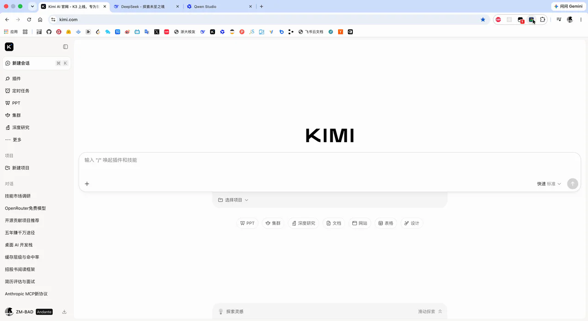

# Headroom

> 知道你的 AI 什么时候快要"忘事"了。

[English](./README.md) | **简体中文**

<p align="center">
  <a href="https://chromewebstore.google.com/detail/headroom/ededcdndmfhljdjppngbhgmaoogcihjc"></a>
  <a href="https://chromewebstore.google.com/detail/headroom/ededcdndmfhljdjppngbhgmaoogcihjc"></a>
  &nbsp;&nbsp;&nbsp;
  <a href="https://microsoftedge.microsoft.com/addons/detail/headroom/hlnpmnlemmiohohhobkbdljomdmhhcnl"></a>
  <a href="https://microsoftedge.microsoft.com/addons/detail/headroom/hlnpmnlemmiohohhobkbdljomdmhhcnl"></a>
  &nbsp;&nbsp;&nbsp;
  <a href="https://addons.mozilla.org/firefox/addon/headroom/"></a>
  <a href="https://addons.mozilla.org/firefox/addon/headroom/"></a>
</p>

**Headroom** 是一个浏览器扩展，在 AI 聊天对话中实时可视化 context window 使用量——在你的 AI 开始悄悄遗忘重要细节之前提醒你。



## 功能

- **零配置** — 无需注册、无需 API Key、无需任何设置。装上就能用。
- **实时仪表盘** — 边聊边看 context window 使用量的变化。🟢 绿色（空间充裕）· 🟠 黄色（接近上限）· 🔴 红色（该开新对话了）。
- **逐轮明细** — 每一轮问答的 token 估算量，输入、输出分别展示，搜索/工具调用的 token 单独一列。
- **隐私优先** — 对话文本仅瞬时读取用于计数，用完即弃。只存储 token 计数，本地或你自己的云存储均可。Headroom 没有自建服务器。

**支持平台及默认上下文：** **DeepSeek (1M)、ChatGPT (27K)、Gemini (1M)、Kimi (1M)、Qwen (1M)、通义千问 (1M)、豆包/Doubao (256K)。**

上下文上限按平台自动识别，支持用户按平台覆盖。7 家平台的请求解析和 DOM 选择器均经真机实测确认（2026-08）。采用平台无关的适配器架构——新增 AI 聊天平台只需编写一个新适配器。

## 为什么用 Headroom

当你和 AI 进行很长的对话时，你可能遇到过这些：10 轮前设定的约束被遗忘、早前的决策被推翻、输出质量悄悄下降。**context window 有上限**——当它被填满，AI 会悄无声息地丢弃早期信息。所有主流 AI 聊天平台都没有告诉你 context 还剩多少。

**面向谁？** 日常高频使用 AI 聊天的专业人士——开发者、研究者、写作者、分析师。如果你的对话经常超过 20+ 轮，用于架构讨论、代码评审、深度调研或技术文档撰写，Headroom 帮你保持对话质量。

> **不是 token 计费工具。** AI 模型越来越便宜——核心问题是**上下文质量**：确保你的 AI 没有悄悄遗忘什么关键的东西。

## 安装要求

> 从[页面顶部的浏览器图标 ↑](#headroom)进入商店下载——每个图标都链接到对应商店。

Headroom **仅支持 Manifest V3**（不支持 MV2），需要较新的浏览器版本：**Google Chrome ≥ 149、Microsoft Edge ≥ 149、Firefox ≥ 151。**

**已知平台差异**

| 行为                     | Chrome | Edge                 | Firefox                    |
| ------------------------ | ------ | -------------------- | -------------------------- |
| 非 AI 页面图标变灰       | ✅     | ✅                   | ✅                         |
| 离开 AI 页面面板自动关闭 | ✅     | ✅                   | ❌（侧栏内容切换为提示页） |
| 回到 AI 页面面板自动恢复 | ✅     | ❌（需手动点击图标） | ✅（内容自动恢复）         |

**Edge 限制：** `sidePanel.setOptions({ enabled: true })` 从非 AI 页面切回后不会自动恢复面板。Microsoft 已确认这是"设计如此"（[issue #222](https://github.com/microsoft/MicrosoftEdge-Extensions/issues/222)，2024年11月创建，至今未修复）。替代方案：点击工具栏图标手动打开。

**Firefox 限制：** `sidebarAction.close()` 需要用户手势，标签页切换不算用户手势，因此侧栏无法程序化关闭，必须用户手动关闭（Firefox 平台限制）。切换到非 AI 页面时，侧栏内容通过 `sidebarAction.setPanel()` 切换为提示页。

## 可选：Upstash 同步

不配置任何云服务，Headroom 就是完整可用的。对大多数用户的大多数场景，这就是全部。

你也可以选择接入自己的 [Upstash](https://upstash.com/) Redis KV——注册免费账号，创建一个 KV 实例，把 REST 凭据填入扩展设置（BYOK：数据存在你自己的私有存储中，凭据绝不离开你的浏览器）。接入后额外获得：

- **设置跨设备同步** — 阈值、语言、各平台上下文上限、token 系数覆盖，在一台设备上保存后，另一台设备下次打开面板即自动生效。
- **计数保底** — 当平台的历史接口偶发拉不全时（超长对话触发分页上限、分页拉取中断），云端记录会保留已经计过的轮次，累计数不会悄悄缩水。

Upstash 免费层（[定价](https://upstash.com/pricing/redis)）包含 256 MB 存储和每月 50 万次命令——远超单用户实际产生量。Headroom 每轮只存 token 计数（不存对话文本），存储完全不构成瓶颈（50 轮对话约 4 KB）。

## 技术栈

- **[WXT](https://wxt.dev/)** — 下一代 Web 扩展框架 (Manifest V3)
- **原生 Side Panel API** — 浏览器原生侧边栏 (Chrome `sidePanel`、Firefox `sidebarAction`)
- **启发式 token 估算** — 六路文字系统系数引擎（中日韩/假名/谚文/西里尔/阿拉伯/拉丁）；汉字类按字计，单词类按词计。不打包重型 tokenizer（保持扩展轻量、模型无关）
- **Upstash Redis KV** — 可选的用户自有云存储（BYOK 模式）

## 贡献与开发

欢迎 Bug 反馈、功能建议和代码贡献！

- **遇到问题？** → [提交 issue](https://github.com/ZM-BAD/headroom/issues/new/choose)
- **想要贡献代码？** → 阅读 [贡献指南](./CONTRIBUTING.md)
- **帮忙测试？** → 查看标记了 `needs-test` 的 [开放 issue](https://github.com/ZM-BAD/headroom/issues)

**开发**

```bash
npm install
npm run dev            # 开发模式 (Chrome 默认)
npm run dev:firefox    # Firefox 开发模式
npm run build          # 生产构建
```

详见 [AGENTS.md](./AGENTS.md) 获取完整开发指南和架构详情。

## 隐私

Headroom 读取你的对话文本仅用于计算 token——它**只存储计数**，绝不存储文本本身，数据存在你的设备和**你自己的** Upstash KV（如已配置）。Headroom 没有自建服务器，没有第三方追踪。详见 [PRIVACY.md](./PRIVACY.md)。

## 许可证

Copyright 2026 ZM-BAD。

基于 **Apache License, Version 2.0** 授权 — 详见 [LICENSE](./LICENSE)。你可以在以下地址获取协议副本：

    http://www.apache.org/licenses/LICENSE-2.0

除非适用法律要求或书面同意，否则依据本协议分发的软件均按"原样"分发。
