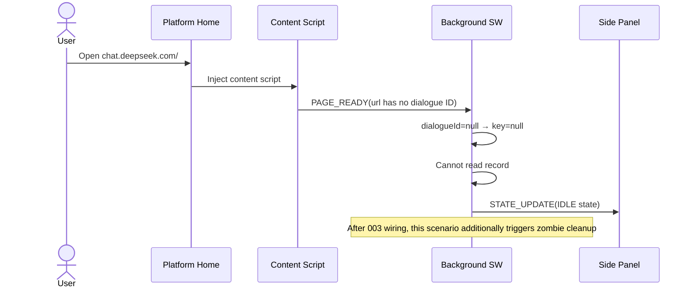
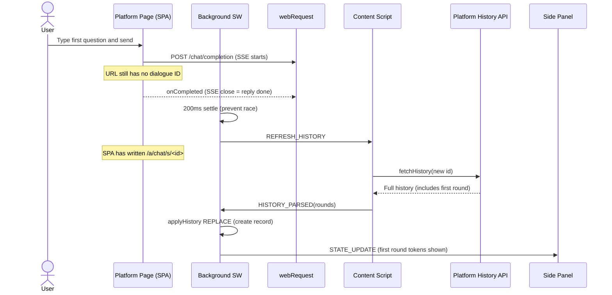
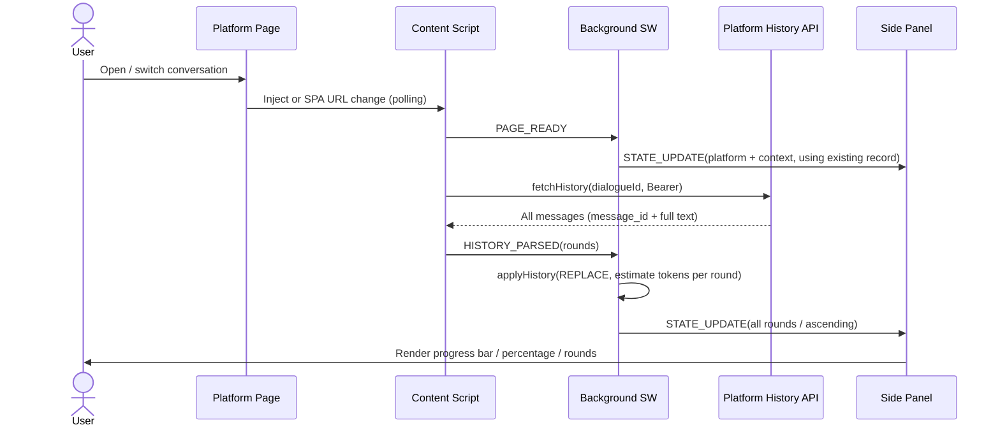
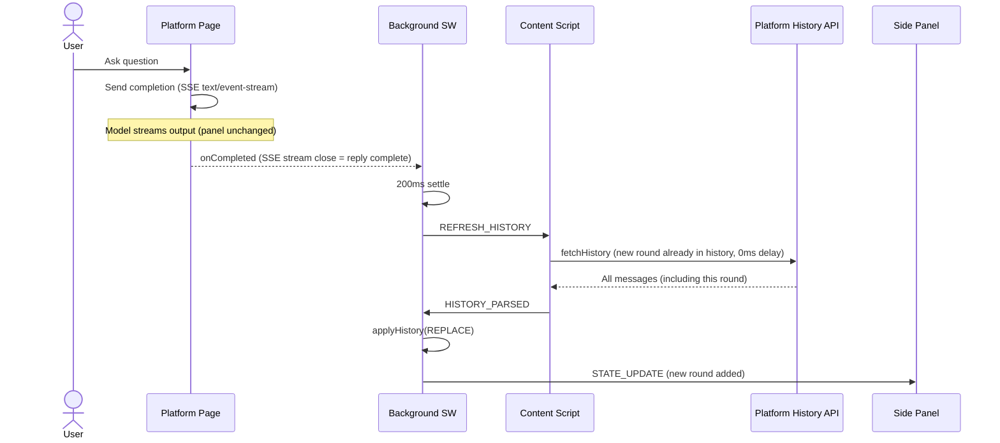
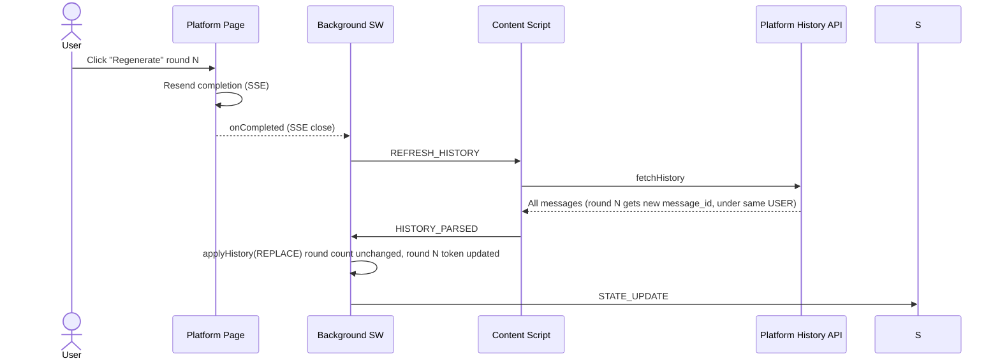

# 001: Headroom Core — Context Monitor + Estimation Engine + Adapter Base

## Status

DeepSeek single-device end-to-end implemented and passed live acceptance (Gate 1 ✅, 2026-06); remaining 6 adapters + `fetchHistory` implemented (parse shapes confirmed via Playwright), live end-to-end acceptance pending (Gate 2); Edge/Firefox smoke pending (Gate 3).

**Scope**: Single-device real-time layer. The gauge works purely locally, does not depend on the cloud — **can be released independently**. Upstash transport pipeline goes to [002](./002-upstash-data-layer.md); cross-device sync, reconciliation, and delete linkage go to [003](./003-cross-device-sync.md).

## Summary

In the browser's native side panel on AI chat platforms, this spec displays the current conversation's cumulative token consumption as a percentage of the context window in real time, with three-level color warnings (green/yellow/red). It includes a configurable **token estimation engine** by "platform × writing system" and a platform-agnostic **adapter architecture** (DeepSeek fully implemented initially).

Core stance: **tokens are always "estimated from text"** — platforms don't tell you how much context they've used, and platforms likely don't store per-round tokens either, so the truth is the **text content** of the platform's history, and tokens are estimated by us using the coefficient matrix. This spec only does the single-device real-time layer; combining this spec's estimation capability with [002](./002-upstash-data-layer.md)'s transport pipeline to achieve cross-device reconciliation is [003](./003-cross-device-sync.md)'s job.

## Motivation

### Pain Point

Professional users conducting long conversations on AI chat web apps (knowledge learning, technical research) gradually fill the context window. The AI never tells you "I've already forgotten the critical constraint you mentioned in round 3" — it just silently loses detail, output quality degrades for unknown reasons.

**No major AI chat platform displays remaining context window space in the UI.** Headroom fills this gap.

### What It's Not

- Headroom is not a token billing / cost monitoring tool. Models are getting cheaper — cost is not the problem.
- Headroom **does not guarantee context quality** — Headroom only does statistics and warnings; it cannot guarantee quality.

### Why the Estimation Engine Is a First-Class Citizen

To know how much context has been used, you must count tokens. There are two paths:

- **Bundle each platform's tokenizer**: Huge vocabularies, different encodings per model, makes the extension heavier and tightly coupled to models.
- **Estimate by statistical regularity**: Lightweight, model-independent, accuracy guaranteed by the "platform × writing system" coefficient matrix.

Headroom chooses estimation. v1 handles two writing systems — Chinese (CJK) + English (Latin); 004 has upgraded to 6 writing systems (CJK / Kana / Hangul / Cyrillic / Arabic / Latin). Per-platform tokenizer calibration is pending, see [004](./004-optimizations.md).

### Target Users

Professionals who use AI chat web apps daily (developers, researchers, writers, analysts).

## Requirements

### P0 — Core

- [x] **Real-time context usage visualization**: progress bar + percentage
- [x] **Three-level color warning** (customizable in settings panel, dual slider): 🟢 green (< yellow threshold, default 50%) / 🟠 yellow (yellow ≤ usage < red, default 50%/70%) / 🔴 red (≥ red threshold)
- [x] **Platform identification + context matching**: domain → platform, match that platform's context window limit; user can override per platform in settings (defaults to adapter `contextLimit`)
- [x] **Token estimation engine**: text → token, by "writing system × platform" coefficients; 6 writing systems (CJK / Kana / Hangul / Cyrillic / Arabic / Latin), user can override coefficients
- [x] **Adapter architecture**: complete contract (see Design), DeepSeek fully implemented; interface reserves room for new platforms
- [x] **Incremental round capture**: `webRequest.onCompleted` (SSE stream close = reply complete) → pull platform history API (message_id authoritative) → re-estimate per round (net new this round) → update gauge
- [x] **Local working state**: the gauge's read source, purely local, does not depend on the cloud
- [x] **URL scoping**: non-matching pages have `action.disable` graying, side panel does not respond
- [x] **User settings panel**: threshold dual slider / context override / UI language switch / Upstash config (URL · Test · Clear · Save)

### P1 — Enhancement

- [x] **Side panel toggle**: click extension icon to open/close native side panel
- [x] **Round count display**
- [x] **Conversation identity display**: side panel shows current conversation title + dialogueId (display only, not written to record, not uploaded to cloud)

## Browser Support

**Manifest V3 only** (MV2 not supported), requires relatively recent browser versions:

| Browser        | Minimum Version |
| -------------- | --------------- |
| Google Chrome  | ≥ 149           |
| Microsoft Edge | ≥ 149           |
| Firefox        | ≥ 151           |

> **Decision: no Firefox MV2 support.** Chrome/Edge already mandate MV3; the background must be written in service worker semantics (state persisted to `browser.storage.local`, rebuilt after wake); Firefox MV3 uses event pages, more lenient. Adding MV2 support would only mean one more background lifecycle path and test matrix — no code saved — the strictest service worker model is locked by Chrome, cannot be bypassed with MV2.

## Design

### User Interaction Scenarios (Local Layer)

> Technical triggers and local behaviors for 6 user interactions. This is the requirement skeleton for this spec's Data Flow diagrams A/B/C — each diagram corresponds to interactions 3 / 4a / 4b. Cross-device upgrades after 003 wiring are in [003](./003-cross-device-sync.md) "User Interaction Scenarios" matrix.

| #   | Interaction                                 | Trigger (Technical)                                                                                                                                                                                                         | Local Behavior (001)                                                                                                                                                                                                                                                                                                                                           |
| --- | ------------------------------------------- | --------------------------------------------------------------------------------------------------------------------------------------------------------------------------------------------------------------------------- | -------------------------------------------------------------------------------------------------------------------------------------------------------------------------------------------------------------------------------------------------------------------------------------------------------------------------------------------------------------- |
| 1   | Open platform home (no conversation opened) | content script injected → `PAGE_READY`; URL has no dialogue ID (`dialogueIdFromUrl` returns null)                                                                                                                           | IDLE state: cannot read record → gauge idle, action still enabled (platform matched). 003 adds zombie cleanup                                                                                                                                                                                                                                                  |
| 2   | Start new conversation, first round         | Send prompt → `onBeforeRequest` hits completion URL; stream closes → `onCompleted`. **First round dialogue ID appears with a delay**: URL still has no ID at send time; SPA writes `/a/chat/s/<id>` after platform responds | `onCompleted` → 200ms settle → `REFRESH_HISTORY` → `fetchHistory` (URL now has ID) → `applyHistory` REPLACE. **First round recovery relies on onCompleted-triggered `REFRESH_HISTORY`, not URL polling** — `fetchAndShipHistory` silently returns when `dialogueId===null`; 1.5s polling only handles SPA conversation switch (interaction 3), not first round |
| 3   | Open existing conversation                  | content script injected → `PAGE_READY` + `fetchAndShipHistory`; SPA-internal switch captured by URL polling (1.5s) to detect href change                                                                                    | `fetchHistory` → `HISTORY_PARSED` → `applyHistory` REPLACE local record → broadcast gauge (purely local, doesn't touch cloud). **Upgraded to union merge in 003**                                                                                                                                                                                              |
| 4a  | Append new Q&A round                        | `webRequest.onCompleted` hits `completionUrl` (SSE stream close = model finished)                                                                                                                                           | `onCompleted` → 200ms settle → `REFRESH_HISTORY` → `fetchHistory` (new round already in history, 0ms delay) → `applyHistory` REPLACE → gauge +1 round                                                                                                                                                                                                          |
| 4b  | Regenerate / Stop generation                | `onCompleted` (regenerate) / `onErrorOccurred` (stop generation = abnormal stream close)                                                                                                                                    | Same pipeline as 4a → `applyHistory` REPLACE. **Round count unchanged**: platform history round N gets new `message_id` but under same USER; REPLACE updates round N tokens, count stays N                                                                                                                                                                     |
| 5   | Delete conversation                         | `onBeforeRequest` hits `deleteUrl` + `deleteMethod` match + `parseDelete` extracts dialogueId from body                                                                                                                     | `handleDelete` → delete local record → re-project active tab (gauge resets). **Local delete only**; 003 adds Upstash DEL                                                                                                                                                                                                                                       |

**Core insight**: Interactions 2 / 3 / 4a / 4b share the same "pull history → estimate → REPLACE" pipeline (content script pulls history → background estimates → REPLACE locally), differing only in trigger timing (inject / URL change / onCompleted). Interactions 1 and 5 are independent branches outside this pipeline.

#### Sequence Diagram · Interaction 1 — Home Page State

Home URL has no dialogueId; `fetchHistory` no-ops (`dialogueIdFromUrl` returns null → immediate return), gauge enters IDLE state.



#### Sequence Diagram · Interaction 2 — Start New Conversation, First Round

URL has no dialogueId at first-round send time; must wait for SPA to write it after platform responds; after onCompleted, settle then pull history.



#### Sequence Diagram · Interaction 5 — Delete Conversation

After `deleteUrl` hit, disambiguate by `deleteMethod`; `parseDelete` extracts id; delete local + re-project. 003 adds Upstash DEL at the dashed line.

```mermaid
sequenceDiagram
    actor U as User
    participant P as Platform Page
    participant W as webRequest
    participant B as Background SW
    participant L as Local Cache
    participant S as Side Panel
    U->>P: Delete a conversation
    P->>W: POST /chat_session/delete (body contains id)
    W->>B: onBeforeRequest hits deleteUrl
    B->>B: method match + parseDelete(body) → id
    B->>L: delLocalDialogue(key)
    B->>B: Re-project active tab
    B->>S: STATE_UPDATE (reset to zero)
    B--)R: 003: delDialogue(Upstash DEL, best-effort)
    Note over B,R: 003 wiring adds dashed step;<br/>mobile deletion goes through periodic alarm / home-page diff cleanup
```

### Architecture

```
┌─────────────────────────────────────────────────────┐
│  Browser (Chrome / Edge / Firefox)                   │
│                                                       │
│  ┌──────────────┐  ┌──────────────┐  ┌────────────┐ │
│  │  Side Panel   │  │  Background  │  │  Content   │ │
│  │  (UI display) │  │  Service     │  │  Script    │ │
│  │               │  │  Worker      │  │ (one,      │ │
│  │  - progress   │◄─►│              │◄─►│  all-plat) │ │
│  │    bar        │  │  - estimation│  │            │ │
│  │  - percentage │  │  - round     │  │  - DOM     │ │
│  │  - warning    │  │    pairing   │  │    scraping│ │
│  │    color      │  │  - warning   │  │  - reply   │ │
│  │  - round      │  │    judgment  │  │    detect  │ │
│  │    count      │  │  - action    │  │            │ │
│  │  - settings   │  │    graying   │  │            │ │
│  │    panel      │  │              │  │            │ │
│  └──────────────┘  └──────────────┘  └────────────┘ │
└─────────────────────────────────────────────────────┘
              ↑ 001 data flow stops here, purely local
              │ (Upstash pipeline 002 / cross-device reconciliation 003, not in this spec)
```

Three entrypoints: `entrypoints/sidepanel/` (UI), `entrypoints/background.ts` (engine: estimation + webRequest interception matching + round pairing + state projection + action graying), `entrypoints/platform.content.ts` (**one** content script (injected per adapter `matchPattern`), covering all platforms).

### Entrypoints

| Entrypoint | File                              | Responsibility                                                                                                            |
| ---------- | --------------------------------- | ------------------------------------------------------------------------------------------------------------------------- |
| sidepanel  | `entrypoints/sidepanel/`          | UI: gauge main view + settings view                                                                                       |
| background | `entrypoints/background.ts`       | Engine: estimation, webRequest interception matching, round pairing, state projection, warning, action graying            |
| content    | `entrypoints/platform.content.ts` | **Single** content script, injected on all platforms per adapter `matchPattern`; DOM-scrape AI replies, send page signals |

### Token Estimation Engine ★Core

**Model**:

```
tokens(text, platform) = Σ over writing systems s  [ count(text, s) × coeff(s, platform) ]
```

- **Writing system (script)** = a symbol system for writing, e.g. Chinese characters (CJK), Latin, Cyrillic, Arabic, Kana. Estimation **buckets by writing system, not by language** — a single message often mixes multiple scripts, and tokenization cost depends on the symbol system, not the language; per-character script detection → bucket counting → multiply by that writing system's coefficient on that platform. (Here "script" means Unicode writing system, **unrelated to program scripts like Python/JavaScript**.)
- v1 has two writing systems:
  - **CJK (Chinese etc.)**: counted per character. `tokens = cjkChars × cjkCoeff`
  - **Latin (English etc.)**: counted per word. `tokens = latinWords × latinCoeff` (words = whitespace-separated)
  - Other writing systems (Spanish/German/French/Japanese/Russian/Portuguese/Arabic…) v1 temporarily falls back to the Latin bucket for estimation; 004 adds independent coefficients.
- Coefficients are **writing system × platform** two-dimensional: each adapter provides a default coefficient table, user can override in settings (P1). Same writing system has different coefficients under different platform tokenizers (e.g. DeepSeek and Qwen/GPT have different Chinese character coefficients).
- **v1 defaults (pending 004 calibration, below are starting values)**: DeepSeek `cjk ≈ 0.6 token/ch`, `latin ≈ 0.5 token/wd`. Other platforms inherit same values until calibrated against their own tokenizer.
- **Does not depend on platform server tokens**: even if some platforms occasionally return token usage in API responses, it is only used as 004 calibration reference, not in the core path. The product is designed as "text → estimate".

**Per-round input/output estimated separately**: prompt text → `promptTokens`, answer text → `answerTokens`, round `total = promptTokens + answerTokens`.

### Adapter Pattern (Platform-Agnostic, New Platform = Register + One File)

Adding a new AI platform = register + write one `adapters/<platform>.ts`. Complete contract (**Owner** column indicates which spec defines/uses the field):

| Field                                                         | Owner   | Description                                                                                                                                                                                                                                               |
| ------------------------------------------------------------- | ------- | --------------------------------------------------------------------------------------------------------------------------------------------------------------------------------------------------------------------------------------------------------- |
| `platformId` / `displayName` / `host` / `matchPattern`        | 001     | Platform id + display name; content injection + host matching                                                                                                                                                                                             |
| `completionUrl`                                               | 001     | `webRequest.onCompleted` filter = reply complete (SSE stream close, root cause; not DOM heuristics)                                                                                                                                                       |
| `contextLimit`                                                | 001     | Default context window, user-overridable                                                                                                                                                                                                                  |
| `tokenCoefficients { cjk, latin }`                            | 001     | Default estimation coefficients, user-overridable                                                                                                                                                                                                         |
| `dialogueIdFromUrl?(url)`                                     | 001     | Derive dialogue ID from URL (conversation switch → gauge reset)                                                                                                                                                                                           |
| `dialogueTitleFromDoc?(doc) → string \| null`                 | 001     | Conversation title (content-script scraped from DOM); **display only, not written to `DialogueRecord`, not uploaded to cloud** (title may contain sensitive info)                                                                                         |
| `fetchHistory?(dialogueId) → HistoryRound[]`                  | 001     | **Core truth source**: pull full platform history; `HistoryRound` carries **stable messageId** (003 union merge key) + `order` (time-order key) + `promptText`/`answerText`. Used on open / switch / reply-complete; tokens are always estimated from it. |
| `answerSelector` / `userSelector?` / `conversationSelector`   | 001     | DOM fallback primitives; currently unused by history-authoritative core, reserved for platforms without history API                                                                                                                                       |
| `deleteUrl` / `parseDelete` / `deleteHost?` / `deleteMethod?` | 001+003 | Delete linkage: local record reset (001 background); cloud DEL (003)                                                                                                                                                                                      |
| `fetchConversationList?() → string[]`                         | 003     | Zombie cleanup: pull conversation id list                                                                                                                                                                                                                 |

001 implements DeepSeek's 001 fields (`fetchHistory` implemented and live-verified); 003 fields only occupy contract slots in this spec. The background is a platform-agnostic engine — only recognizes the adapter interface; the history API is the sole truth source for round identity and tokens.

**DeepSeek Reference Implementation (001 scope)**:

| Item                | Value                                                                                                    |
| ------------------- | -------------------------------------------------------------------------------------------------------- |
| `matchPattern`      | `chat.deepseek.com`                                                                                      |
| `completionUrl`     | `*://chat.deepseek.com/api/v0/chat/completion` (SSE, onCompleted)                                        |
| `contextLimit`      | 1,048,576 (= 1 << 20)                                                                                    |
| `fetchHistory`      | `GET /api/v0/chat/history_messages?chat_session_id=` (Bearer token + x-client-* headers, live-confirmed) |
| `dialogueIdFromUrl` | `/a/chat/s/<id>` → `chat_session_id`                                                                     |
| `tokenCoefficients` | `cjk 0.6 / latin 0.5` (v1 starting values, pending 004 calibration)                                      |

### 7-Platform Context Defaults (DeepSeek validated first, others fast-follow)

| Platform       | Page Host         | Context (Default) | fetchHistory (History API Reverse-Engineered)   |
| -------------- | ----------------- | ----------------- | ----------------------------------------------- |
| DeepSeek       | chat.deepseek.com | 1,048,576 (1<<20) | ✅ implemented + live-verified                  |
| ChatGPT        | chatgpt.com       | 131,072 (1<<17)   | ✅ implemented (confirmed live)                 |
| Gemini         | gemini.google.com | 1,048,576 (1<<20) | ✅ DOM fallback (confirmed live, no usable API) |
| Kimi           | www.kimi.com      | 262,144 (1<<18)   | ✅ implemented (confirmed live)                 |
| Qwen           | chat.qwen.ai      | 1,048,576 (1<<20) | ✅ implemented (confirmed live)                 |
| Tongyi Qianwen | www.qianwen.com   | 1,048,576 (1<<20) | ✅ implemented (confirmed live)                 |
| Doubao         | www.doubao.com    | 262,144 (1<<18)   | ✅ implemented (confirmed live)                 |

> All 7 platforms' DOM selectors + API host/path confirmed via live testing (2026-06). **001's acceptance milestone is gated on DeepSeek passing**; remaining 6 adapters have fields ready; deep runtime acceptance is in 004.

### Data Flow (001 scope, purely local)

History API is the **sole truth source** for round identity and tokens; DOM does not participate in round identity determination. Open conversation, switch conversation, and reply complete all follow the same "pull history → REPLACE record" path.

> **REPLACE is 001 single-device-layer semantics; upgraded to union merge after 003 wiring.** At 001 stage, history is local truth and REPLACE suffices; 003 adds "read cloud record → union merge → display-first-then-sync" orchestration to the same primitive, gaining cross-device capability. The three diagrams below show 001 single-device-layer flow; the 003 upgrade of "open conversation" (Diagram A) is in [003](./003-cross-device-sync.md) "User Interaction Scenarios" sequence diagram.

**Diagram A · Open Conversation** (first open, mobile-initiated web view — extension does not distinguish origin; uniformly pulls history):



**Diagram B · New Q&A Round** (including "reply complete" detection):



**Diagram C · Regenerate** (variant of B; explains why no extra round is counted):



**No Upstash (in data flow terms).** 001's data flow (pull history → estimate → project) does not touch the cloud at any point; the settings panel has Upstash config controls, but cloud actions belong to [002](./002-upstash-data-layer.md) / [003](./003-cross-device-sync.md) and are inert when not configured. Cloud persistence and cross-device reconciliation for this round go to 003.

### Platform Adaptation Reference (DeepSeek as Template)

When adding / debugging a platform, troubleshoot against this list; each item is a verified landmine, not generic advice.

**A. Find the root cause for "reply complete", not the surface-level signal** — Surface-level signal: a single send button toggles between stop and send states. Root cause: **streaming completion response (SSE, `text/event-stream`) closes** = reply complete. Use `webRequest.onCompleted` (same as `completionUrl`); forbid DOM text debounce, forbid listening to button state. `onErrorOccurred` (user stop / disconnect) handled the same way.

**B. Round identity uses message_id, not DOM counting** — DeepSeek uses virtual list (`ds-virtual-list`); only ~2 visible items exist in DOM at a time, earlier ones are unloaded; DOM counting from round 2 permanently returns 2. Correct solution: history API returns each message's `message_id` + `parent_id` (answer → question pairing); one round = USER + its ASSISTANT child message. Any platform using a virtual list has unreliable DOM; must go through history API.

**C. History API auth = Bearer token, and "Copy as cURL" will deceive you** — DeepSeek's history_messages requires `authorization: Bearer <token>` (token in `localStorage.userToken`, wrapped as `{value}`) + a set of `x-client-*` headers; cookie-only → `code 40003 INVALID_TOKEN`. **Key trap: browser "Copy as cURL" strips the Authorization header for security** — reverse-engineering auth must look at the **real request headers** captured via DevTools Network / Playwright; cURL is untrustworthy.

**D. History API: full, no pagination, no delay** — Verified: returns all messages in one call (33 rounds / 66 messages / 27KB); `limit` / `page_size` parameters are ignored; no pagination fields; new round is in history immediately at onCompleted (0ms delay). Single GET fetches everything; no paging, no retry.

**E. API reverse-engineering cannot be reproduced cross-environment** — `cf_clearance` / `ds_session_id` are IP-bound; running the user's curl from another machine always returns `INVALID_TOKEN`; reverse-engineering must be done in the user's real browser or a self-controlled Playwright session.

### Data Model (001 scope, local)

```
headroom:settings            → { thresholds, language, contextLimits (override), upstash? (credentials) }
headroom:conv:{p}:{id}        → DialogueRecord (current active conversation)
```

> **`contextLimits` is delta storage** (same model as 004's `tokenCoefficients`): only entries that differ from the adapter's built-in `contextLimit` are stored — locally and in the cloud. Never persist the full default map: a baked-in default is indistinguishable from a user override, so users who ever saved would be pinned to stale defaults when an adapter's limit is updated. On read, stored entries equal to the **current** adapter default are treated as non-overrides and dropped (self-heals legacy full-map data).

**`DialogueRecord` / `RoundRecord` store only token counts, never conversation text** (privacy-by-design):

```
RoundRecord    = {
  messageId: string,           // 003 union-merge key — platform-stable round identity
  order: number,               // time-order key (ascending = old→new), derived by adapter from API
  n: number,                   // display sequence (1-based, reassigned after merge by order)
  promptTokens, answerTokens,
  total,                       // promptTokens + answerTokens
  ts: number,                  // wall-clock epoch ms (currently unfilled, always 0; reserved for display/debug)
}
DialogueRecord = {
  platformId, dialogueId, contextLimit,
  rounds: RoundRecord[],       // rolling trim, capped at MAX_RETAINED_ROUNDS
  totalTokens: number,         // real cumulative (trimmed array ≠ lost cumulative)
  roundCount: number,          // real round count
  updatedAt: number,
}
```

- **`messageId`** is the unique stable identity the platform assigns to this round (DeepSeek `message_id`, ChatGPT mapping node id, Doubao `index_in_conv`, etc.) — invariant across fetches — it is 003 union merge's dedup key, positional `n` is not a substitute.
- **`order`** is the time-order key; semantics differ per platform but guaranteed monotonic (DeepSeek = raw message_id, ChatGPT/Kimi/Qwen = epoch ms, Gemini = positional index). `unionRounds` sorts ascending by `order` then reassigns the display `n`.
- **`ts`** is standardized wall-clock time (epoch ms); currently no adapter populates it (always 0). Populating it would not increase Upstash storage cost — the field already exists in the schema.
- **`n`** is display-only; after `unionRounds` merge, assigned 1..k by `order`; not involved in merge logic.

> 001 only maintains the **current active conversation**'s local record (load / create new when switching conversations). Multi-conversation local cache + LRU eviction goes to [003](./003-cross-device-sync.md). `DialogueRecord` structure is defined by 001; 003 adds cloud lifecycle (persistence / reconciliation / cache) on top; the structure is unchanged.

### UI (Side Panel)

Main view and settings view toggle (⚙️ to enter settings):

```
┌─── Main View ──────────────┐    ┌─── Settings View ───────────────┐
│  Headroom            ⚙️     │    │  ← Back                         │
│  DeepSeek                  │    │  Warning Thresholds 🟠50% 🔴70%   │
│  Context: 1M               │    │  Context Override [per platform] │
│  ██░░░░░░  5.0%            │    │  Language [Auto ▾]              │
│  🟢 Plenty of headroom      │    │  Upstash URL / Token / Test      │
│  Rounds: 12  This: 1,520   │    │  [Save Settings]                 │
│  Conversation Rounds       │    └─────────────────────────────────┘
│  #1 ↑1,520 ↓3,048 Σ4,568  │
│  #2  …      …      …       │
│  ⋮                         │
└────────────────────────────┘
```

> Conversation rounds area displays each round's details as a table: header includes "Round", "Input Tokens", "Output Tokens", "This Round Total". This round total is computed by the frontend (promptTokens + answerTokens); no new Upstash storage field added.

- First row shows **platform name** (v1 does not detect specific model; context limit takes adapter default or user override).
- **Upstash fields are input controls**; the cloud actions for "Test Connection" / "Save" are wired by 002 (transport) / 003 (sync). When Upstash is not configured, these controls are inert; the gauge works normally.
- **Conversation identity (title + dialogueId)**: below the platform name, one row shows the current conversation's **title** (displays "Untitled" if missing) and **dialogueId**; shown only when a conversation is opened, hidden on home page. Title extracted by `dialogueTitleFromDoc` from the DOM — **display-only, not written to `DialogueRecord`, not uploaded to Upstash** (title may contain sensitive info; lives only in background memory cached by tabId); dialogueId displayed fully, hoverable to see entire id for verification/copying.

### Browser APIs

| API                                                      | Purpose                                                                                                                                                                                                                                               |
| -------------------------------------------------------- | ----------------------------------------------------------------------------------------------------------------------------------------------------------------------------------------------------------------------------------------------------- |
| `browser.sidePanel` / `browser.sidebarAction`            | Native side panel (WXT auto-adapts)                                                                                                                                                                                                                   |
| `browser.runtime.sendMessage` / `onMessage`              | Sidepanel ↔ Background ↔ Content messages                                                                                                                                                                                                             |
| `browser.storage.local`                                  | Settings + active conversation record                                                                                                                                                                                                                 |
| `browser.action.enable` / `disable(tabId)`               | Gray out action on non-matching pages                                                                                                                                                                                                                 |
| `browser.tabs.onActivated` / `onUpdated`                 | Sync action enable/disable                                                                                                                                                                                                                            |
| `browser.webRequest.onCompleted` / `onErrorOccurred`     | Round trigger: SSE stream close = reply complete (`onErrorOccurred` = user stop / disconnect) → triggers `REFRESH_HISTORY` to pull history                                                                                                            |
| `browser.webRequest.onBeforeRequest` (`["requestBody"]`) | Delete interception: read request body → `parseDelete` extracts dialogueId. Local delete goes to 001; cloud `DEL` goes to [003](./003-cross-device-sync.md). Prompt and dialogueId are derived separately by `fetchHistory` / URL; send body not read |

## Implementation Plan

1. **Estimation engine (TDD)**: writing-system bucketing (CJK/Latin) + coefficient table + mixed-script accumulation; DeepSeek default coefficients.
2. **Adapter contract + DeepSeek full implementation** (001 fields).
3. **Incremental capture loop**: `onCompleted` (SSE close) → `fetchHistory` pulls full history → estimate per round → `applyHistory` REPLACE → project gauge.
4. **Side panel UI** (main view + settings) + action graying.
5. **Local DialogueRecord read/write + invariant tests**.

## Acceptance Criteria

> Accepted in **gate order**. **001 is purely local layer — gates contain no Upstash assertions** (those are 002 / 003).
>
> Detailed steps in [`specs/acceptance-checklist.md`](./acceptance-checklist.md) "001 Core Monitor" section.

### Gate 1 — DeepSeek End-to-End (Required, blocks everything after)

✅ **DeepSeek live acceptance passed (2026-06)**.

- Click extension icon on platform page → native side panel opens, shows Headroom UI
- After one Q&A round, panel updates token count and percentage in real time
- Progress bar changes color (yellow / red) when percentage crosses thresholds
- Thresholds customizable in settings panel
- Shows current platform's context window limit
- Non-matching pages: icon grayed out, click does not open side panel

### Gate 2 — Other 6 Platforms Smoke (fast-follow, doesn't block main path)

> history-authoritative design requires each platform to have `fetchHistory` (history API reverse-engineering, see "Platform Adaptation Reference").

- DeepSeek — accepted (see Gate 1)
- ChatGPT
- Gemini (may have no history API; needs DOM fallback)
- Kimi
- Qwen
- Tongyi Qianwen
- Doubao

Each platform acceptance: can load, opening conversation shows history, panel updates after one Q&A, regenerate doesn't add extra round.

### Gate 3 — Cross-Browser Smoke (catch Chrome-specific assumptions early; deep QA goes to 004)

- Edge and Firefox: installable, panel opens, DeepSeek one Q&A round works

## Open Questions

- Precise calibration values for v1 estimation coefficients (→ 004)
- Writing-system detection and mixed Chinese-English estimation accuracy (→ 004)
- Timeliness of DOM selectors / API host (platform redesign risk)
- Whether `MAX_RETAINED_ROUNDS` needs adjustment: platform history may be longer under 003 full reconciliation; see [003 Open Questions](./003-cross-device-sync.md).
