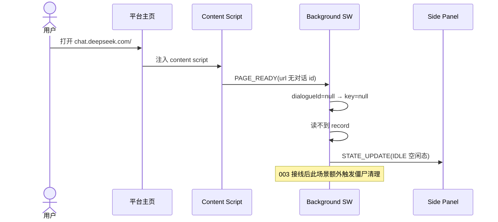
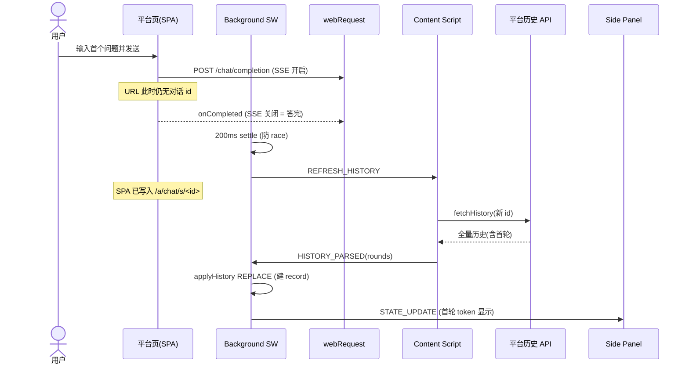
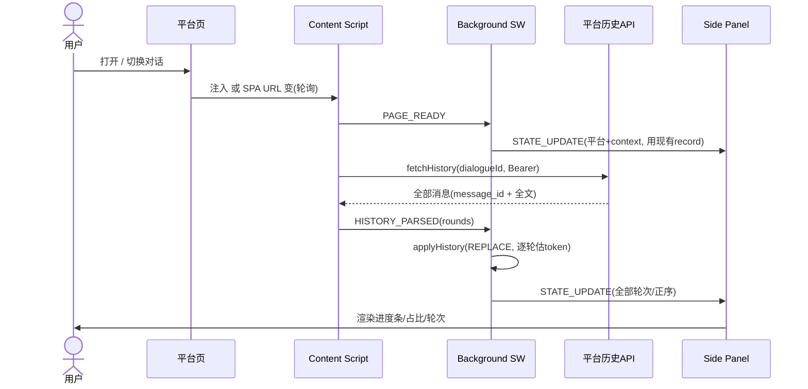
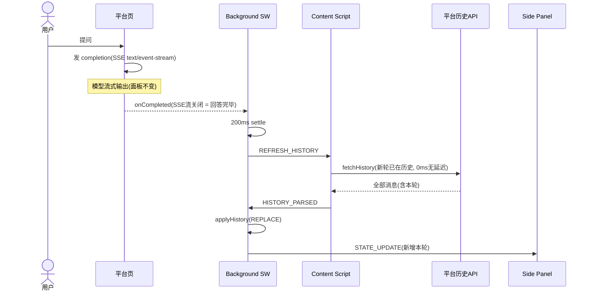
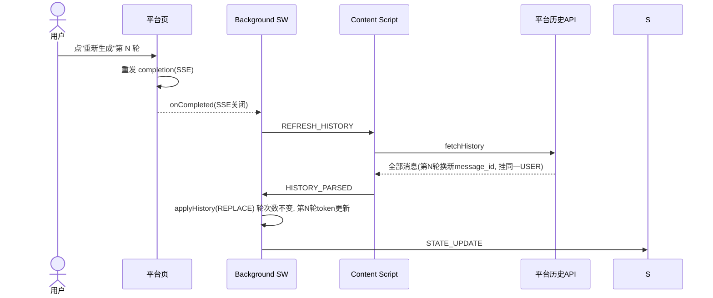

# 001: Headroom Core — Context Monitor + 估算引擎 + 适配器基座

## Status

DeepSeek 单设备端到端已实现并真机验收通过（闸门 1 ✅，2026-06）；其余 6 家 adapter + `fetchHistory` 已实现（parse 形状经 Playwright 实测确认），真机端到端验收 pending（闸门 2）；Edge/Firefox 冒烟待验（闸门 3）。

**范围定位**：单设备即时层。仪表盘纯本地工作，不依赖云端，**可独立发布**。Upstash 传输管道归 [002](./002-upstash-data-layer.md)；跨设备同步、对账、删除联动归 [003](./003-cross-device-sync.md)。

## Summary

在 AI 聊天平台的浏览器原生侧边栏中，实时展示当前对话 token 累计消耗占 context window 的百分比，并提供三级颜色预警（绿/橙/红）。内置可按「平台 × 书写系统」配置的 **token 估算引擎**，以及平台无关的**适配器架构**（首期 DeepSeek 全实现）。

核心立场：**token 永远是"拿到文本后估算出来的"**——平台不告诉你 context 用了多少，而平台也大概率不存每轮 token，所以真值是平台历史的**文本内容**，token 由我们用系数矩阵换算。本 spec 只做单设备即时层；组合本 spec 的估算能力与 [002](./002-upstash-data-layer.md) 的传输管道实现跨设备对账，归 [003](./003-cross-device-sync.md)。

## Motivation

### 痛点

专业用户在 AI 聊天网页端进行长对话（知识学习、技术调研）时，context window 被逐渐填满。AI 不会告诉你"我已经忘了你第 3 轮说的关键约束"——它只是悄无声息地丢失细节，输出质量下降但用户不知道原因。

**没有一个主流 AI 聊天平台在 UI 上展示 context window 剩余空间。** Headroom 填补这个空白。

### 不是什么

- Headroom 不是 token 计费/成本监控工具。模型越来越便宜，计费不是问题。
- Headroom **不保障上下文质量**——Headroom只进行统计以及预警工作，无法保障。

### 为什么估算引擎是一等公民

要知道 context 用了多少，就得算 token。算 token 有两条路：

- **打包各家 tokenizer**：词表巨大、各模型编码不同、会让扩展变重且强绑定模型。
- **根据统计规律进行估算**：轻量、模型无关，精度靠「平台 × 书写系统」系数矩阵保证。

Headroom 选估算。v1 做中文（CJK）+ 英文（Latin）两种书写系统；更多书写系统（西/德/法/日/俄/葡/阿…）与按平台 tokenizer 精确校准，见 [004](./004-optimizations.md)。

### 目标用户

日常使用 AI 聊天网页版的专业人士（开发者、研究者、写作者、分析师）。

## Requirements

### P0 — 核心

- [x] **实时 context 占比可视化**：进度条 + 百分比
- [x] **三级颜色预警**（阈值可在设置面板自定义，双滑块）：🟢 绿（< 黄阈值，默认 50%）/ 🟡 黄（黄≤占比<红，默认 50%/70%）/ 🔴 红（≥ 红阈值）
- [x] **平台识别 + context 匹配**：domain → platform，匹配该平台 context window limit；用户可在设置按平台覆盖（默认值取 adapter `contextLimit`）
- [x] **token 估算引擎**：text → token，按「书写系统 × 平台」系数；v1 书写系统 = 中文（CJK）+ 英文（Latin）
- [x] **适配器架构**：完整契约（见 Design），DeepSeek 全实现；接口为新增平台预留
- [x] **增量轮次捕获**：webRequest `onCompleted`（SSE 流关闭 = 回答完毕）→ 拉平台历史 API（message_id 权威）→ 逐轮重估（净增本轮）→ 更新仪表盘
- [x] **本地工作状态**：仪表盘的读源，纯本地，不依赖云端
- [x] **URL 作用域**：非匹配页面 `action.disable` 灰化、sidepanel 不响应
- [x] **用户设置面板**：阈值双滑块 / context 覆盖 / UI 语言切换 / Upstash 配置（URL·Token·测试·清空·保存）

### P1 — 增强

- [x] **侧边栏开关**：点击扩展图标打开/关闭原生侧边栏
- [x] **轮次计数显示**
- [x] **对话身份展示**：侧边栏显示当前对话标题 + dialogueId（仅展示，不写入 record、不上云）

## Browser Support

**仅支持 Manifest V3**（不支持 MV2），需较新浏览器版本：

| 浏览器         | 最低版本 |
| -------------- | -------- |
| Google Chrome  | ≥ 149    |
| Microsoft Edge | ≥ 149    |
| Firefox        | ≥ 151    |

> **决策：不兼容 Firefox MV2。** Chrome/Edge 已强制 MV3，后台必须按 service worker 语义编写（状态持久化到 `browser.storage.local`、唤醒后重建）；Firefox MV3 用 event page，更宽松。再支持 MV2 只会多一条后台生命周期路径和测试矩阵，不省任何代码——最严的 service worker 模型由 Chrome 锁定，无法靠 MV2 绕开。

## Design

### 用户交互场景（本地层）

> 6 种用户交互的技术触发与本地行为。这是本 spec Data Flow 图 A/B/C 的需求骨架——三张图分别对应交互3/4a/4b。003 接线后的跨设备升级见 [003](./003-cross-device-sync.md)「用户交互场景」矩阵。

| #   | 交互                       | 触发条件（技术）                                                                                                                                                        | 本地行为（001）                                                                                                                                                                                                                                                                                            |
| --- | -------------------------- | ----------------------------------------------------------------------------------------------------------------------------------------------------------------------- | ---------------------------------------------------------------------------------------------------------------------------------------------------------------------------------------------------------------------------------------------------------------------------------------------------------- |
| 1   | 打开平台主页（未点开对话） | content script 注入 → `PAGE_READY`；URL 无对话 id（`dialogueIdFromUrl` 返回 null）                                                                                      | IDLE 态：读不到 record → 仪表盘空闲，action 仍 enabled（平台匹配）。003 加僵尸清理                                                                                                                                                                                                                         |
| 2   | 开启新对话首轮             | 发 prompt → `onBeforeRequest` 命中 completion URL；流关闭 → `onCompleted`。**首轮 dialogueId 延迟出现**：发送瞬间 URL 还没 id，要等平台响应后 SPA 写入 `/a/chat/s/<id>` | `onCompleted` → 200ms settle → `REFRESH_HISTORY` → `fetchHistory`（此时 URL 已有 id）→ `applyHistory` REPLACE。**首轮补回靠 onCompleted 触发的 `REFRESH_HISTORY`，不靠 URL 轮询**——`fetchAndShipHistory` 在 `dialogueId===null` 时静默 return；1.5s 轮询只管 SPA 切换对话（交互3），不管首轮（见下时序图） |
| 3   | 打开已有对话               | content script 注入 → `PAGE_READY` + `fetchAndShipHistory`；SPA 内切换由 URL 轮询（1.5s）捕获 href 变化                                                                 | `fetchHistory` → `HISTORY_PARSED` → `applyHistory` REPLACE 本地 record → 广播仪表盘（纯本地，不碰云）。**003 升级为 union 合并**                                                                                                                                                                           |
| 4a  | 追加新一轮问答             | `webRequest.onCompleted` 命中 `completionUrl`（SSE 流关闭 = 模型答完）                                                                                                  | `onCompleted` → 200ms settle → `REFRESH_HISTORY` → `fetchHistory`（新轮 0ms 已在历史）→ `applyHistory` REPLACE → 仪表盘 +1 轮（见现有图 B）                                                                                                                                                                |
| 4b  | 重新生成/停止生成          | `onCompleted`（重新生成）/ `onErrorOccurred`（停止生成 = 流异常关闭）                                                                                                   | 同 4a 管线 → `applyHistory` REPLACE。**轮数不变**：平台历史第 N 轮换新 `message_id` 但挂同一 USER，REPLACE 后第 N 轮 token 更新、轮数仍 N（见现有图 C）                                                                                                                                                    |
| 5   | 删除对话                   | `onBeforeRequest` 命中 `deleteUrl` + `deleteMethod` 匹配 + `parseDelete` 从 body 解出对话 id                                                                            | `handleDelete` → 删本地 record → 重新投影活动 tab（仪表盘归零）。**只删本地**，003 加 Upstash DEL（见下时序图）                                                                                                                                                                                            |

**核心洞察**：交互 2/3/4a/4b 共用同一条「拉历史 → 估算 → REPLACE」管线（content script 拉历史 → background 估算 → REPLACE 本地），区别只在触发时机（注入 / URL 变 / onCompleted）。交互 1、5 是这条管线之外的独立分支。

#### 时序图 · 交互1 主页态

主页 URL 无对话 id，`fetchHistory` no-op（`dialogueIdFromUrl` 返回 null 直接 return），仪表盘进 IDLE 态。



#### 时序图 · 交互2 开启新对话首轮

首轮发送瞬间 URL 还没对话 id，需等平台响应后 SPA 写入；onCompleted 后 settle 再拉历史。



#### 时序图 · 交互5 删除对话

`deleteUrl` 命中后按 `deleteMethod` 消歧，`parseDelete` 解出 id，删本地 + 重新投影。003 在虚线处加 Upstash DEL。

```mermaid
sequenceDiagram
    actor U as 用户
    participant P as 平台页
    participant W as webRequest
    participant B as Background SW
    participant L as 本地缓存
    participant S as Side Panel
    U->>P: 删除某对话
    P->>W: POST /chat_session/delete (body 含 id)
    W->>B: onBeforeRequest 命中 deleteUrl
    B->>B: method 匹配 + parseDelete(body) → id
    B->>L: delLocalDialogue(key)
    B->>B: 重新投影活动 tab
    B->>S: STATE_UPDATE (归零)
    B--)R: 003: delDialogue(Upstash DEL, best-effort)
    Note over B,R: 003 接线后新增虚线步;<br/>移动端删除走定期 alarm / 首页差集清理
```

### Architecture

```
┌─────────────────────────────────────────────────────┐
│  Browser (Chrome / Edge / Firefox)                   │
│                                                       │
│  ┌──────────────┐  ┌──────────────┐  ┌────────────┐ │
│  │  Side Panel   │  │  Background  │  │  Content   │ │
│  │  (UI 展示)    │  │  Service     │  │  Script    │ │
│  │               │  │  Worker      │  │ (单一,     │ │
│  │  - 进度条     │◄─►│              │◄─►│  全平台)   │ │
│  │  - 占比 %     │  │  - 估算引擎  │  │            │ │
│  │  - 预警颜色   │  │  - 轮次配对  │  │  - DOM 抓取│ │
│  │  - 轮次数     │  │  - 预警判断  │  │  - 回复检测│ │
│  │  - 设置面板   │  │  - action 灰化│ │            │ │
│  └──────────────┘  └──────────────┘  └────────────┘ │
└─────────────────────────────────────────────────────┘
              ↑ 001 数据流到此为止，纯本地
              │ （Upstash 管道 002 / 跨设备对账 003，本 spec 不涉及）
```

三个 entrypoint：`entrypoints/sidepanel/`（UI）、`entrypoints/background.ts`（引擎：估算 + webRequest 拦截匹配 + 轮次配对 + 状态投影 + action 灰化）、`entrypoints/platform.content.ts`（**单一** content script，按 adapter `matchPattern` 注入，覆盖所有平台）。

### Entrypoints

| Entrypoint | 文件                              | 职责                                                                                      |
| ---------- | --------------------------------- | ----------------------------------------------------------------------------------------- |
| sidepanel  | `entrypoints/sidepanel/`          | UI：仪表盘主视图 + 设置视图                                                               |
| background | `entrypoints/background.ts`       | 引擎：估算、webRequest 拦截匹配、轮次配对、状态投影、预警、action 灰化                    |
| content    | `entrypoints/platform.content.ts` | **单一** content script，按 adapter `matchPattern` 注入全平台；DOM 抓 AI 回复、发页面信号 |

### Token 估算引擎 ★核心

**模型**：

```
tokens(text, platform) = Σ over 书写系统 s  [ count(text, s) × coeff(s, platform) ]
```

- **书写系统（script / writing system）**＝文字的符号体系，如汉字（CJK）、拉丁字母、西里尔字母、阿拉伯字母、假名。估算**按书写系统分桶、不按语言**——一条消息常混排多种符号，且 token 化成本取决于符号体系而非语种；逐字符判书写系统 → 归桶计数 → 乘该书写系统在该平台的系数。（此处 "script" 指 Unicode 书写系统，**与 Python/JavaScript 那种程序脚本无关**。）
- v1 两种书写系统：
  - **CJK（中文等）**：按字计。`tokens = cjkChars × cjkCoeff`
  - **Latin（英文等）**：按词计。`tokens = latinWords × latinCoeff`（词 = 空白分隔）
  - 其他书写系统（西/德/法/日/俄/葡/阿…）v1 暂归 Latin 桶估算，004 扩展独立系数。
- 系数是**书写系统 × 平台**二维：每个 adapter 提供默认系数表，用户可在设置覆盖（P1）。同一书写系统在不同平台 tokenizer 下系数不同（如 DeepSeek 与 Qwen/GPT 的汉字系数不同）。
- **v1 默认值（待 004 标定，下为起点值）**：DeepSeek `cjk ≈ 0.6 token/字`、`latin ≈ 0.5 token/词`。其余平台未标定前沿用同值，接入时按各自 tokenizer 调。
- **不依赖平台服务端 token**：即便个别平台 API 偶尔返回 token 用量，也只作 004 校准参考，不计入核心路径。产品形态按"文本 → 估算"设计。

**每轮 input/output 分别估**：prompt 文本 → `promptTokens`，answer 文本 → `answerTokens`，本轮 `total = promptTokens + answerTokens`。

### Adapter Pattern（平台无关，新增平台 = 注册 + 一个文件）

新增一个 AI 平台 = 注册 + 写一个 `adapters/<platform>.ts`。完整契约（**归属**列说明哪个 spec 定义/使用该字段）：

| 字段                                                          | 归属    | 说明                                                                                                                                                                                           |
| ------------------------------------------------------------- | ------- | ---------------------------------------------------------------------------------------------------------------------------------------------------------------------------------------------- |
| `platformId` / `displayName` / `host` / `matchPattern`        | 001     | 平台 id + 展示名；content 注入 + host 匹配                                                                                                                                                     |
| `completionUrl`                                               | 001     | webRequest `onCompleted` 过滤 = 回答完毕（SSE 流关闭，根因；非 DOM 启发式）                                                                                                                    |
| `contextLimit`                                                | 001     | 默认 context window，用户可覆盖                                                                                                                                                                |
| `tokenCoefficients { cjk, latin }`                            | 001     | 默认估算系数，用户可覆盖                                                                                                                                                                       |
| `dialogueIdFromUrl?(url)`                                     | 001     | URL 派生对话 id（切对话 → gauge 重置）                                                                                                                                                         |
| `dialogueTitleFromDoc?(doc) → string \| null`                 | 001     | 对话标题（content-script 从 DOM 抓）；**仅面板展示，不写入 `DialogueRecord`、不上云**（标题可能含敏感信息）                                                                                    |
| `fetchHistory?(dialogueId) → HistoryRound[]`                  | 001     | **核心真相源**：拉平台完整历史；`HistoryRound` 携带**稳定 messageId**（003 union 合并 key）+ `order`（时序键） + `promptText`/`answerText`。打开 / 切对话 / 回答完成都走它，token 永远由它估算 |
| `answerSelector` / `userSelector?` / `conversationSelector`   | 001     | DOM 兜底原语；history-authoritative 核心当前不用，留给无历史 API 的平台                                                                                                                        |
| `deleteUrl` / `parseDelete` / `deleteHost?` / `deleteMethod?` | 001+003 | 删除联动：本地 record 重置（001 background）；云端 DEL（003）                                                                                                                                  |
| `fetchConversationList?() → string[]`                         | 003     | 僵尸清理：拉对话 id 列表                                                                                                                                                                       |

001 实现 DeepSeek 的 001 字段（`fetchHistory` 已实现并真机验过）；003 字段在本 spec 只占契约位。background 是平台无关引擎——只认 adapter 接口，历史 API 是轮次身份与 token 的唯一真相源。

**DeepSeek 参考实现（001 范围）**：

| 项                  | 值                                                                                              |
| ------------------- | ----------------------------------------------------------------------------------------------- |
| `matchPattern`      | `chat.deepseek.com`                                                                             |
| `completionUrl`     | `*://chat.deepseek.com/api/v0/chat/completion`（SSE，onCompleted）                              |
| `contextLimit`      | 1,048,576 (= 1 << 20)                                                                           |
| `fetchHistory`      | GET `/api/v0/chat/history_messages?chat_session_id=`（Bearer token + x-client-\* 头，真机确认） |
| `dialogueIdFromUrl` | `/a/chat/s/<id>` → `chat_session_id`                                                            |
| `tokenCoefficients` | `cjk 0.6 / latin 0.5`（v1 起点值，待 004 标定）                                                 |

### 7 平台 context 默认值（首期 DeepSeek 验通，其余 fast-follow）

| 平台     | 页面 host         | Context（默认）   | fetchHistory（历史 API 逆向）   |
| -------- | ----------------- | ----------------- | ------------------------------- |
| DeepSeek | chat.deepseek.com | 1,048,576 (1<<20) | ✅ 已实现 + 真机验过            |
| ChatGPT  | chatgpt.com       | 131,072 (1<<17)   | ✅ 已实现（实测）               |
| Gemini   | gemini.google.com | 1,048,576 (1<<20) | ✅ DOM 兜底（实测，无可用 API） |
| Kimi     | www.kimi.com      | 262,144 (1<<18)   | ✅ 已实现（实测）               |
| Qwen     | chat.qwen.ai      | 1,048,576 (1<<20) | ✅ 已实现（实测）               |
| 通义千问 | www.qianwen.com   | 1,048,576 (1<<20) | ✅ 已实现（实测）               |
| 豆包     | www.doubao.com    | 262,144 (1<<18)   | ✅ 已实现（实测）               |

> 7 家 DOM 选择器 + API host/path 均经真机实测确认（2026-06）。001 的**验收里程碑以 DeepSeek 验通为准**；其余 6 家 adapter 字段就绪，深度 runtime 验收见 004。

### Data Flow（001 scope，纯本地）

历史 API 是轮次身份与 token 的**唯一真相源**；DOM 不参与轮次身份判定。打开对话、切对话、回答完成走同一条"拉历史 → REPLACE record"的路径。

> **REPLACE 是 001 单设备层语义；003 接线后升级为 union 合并。** 001 阶段历史即本地真值，REPLACE 够用；003 让同一原语加上"读云 record → union 合并 → 先显示后同步"的编排，获得跨设备能力。下述三图是 001 单设备层流程；打开对话（图 A）的 003 升级版见 [003](./003-cross-device-sync.md)「用户交互场景」的时序图。

**图 A · 打开对话**（首次开启、移动端发起网页端查看——扩展不区分来源，统一拉历史）：



**图 B · 新增一轮问答**（含"回答完毕"判定）：



**图 C · 重新生成**（B 的变体；说明为何不多算一轮）：



**无 Upstash（指数据流）。** 001 的数据流（拉历史 → 估算 → 投影）全程不碰云端；设置面板虽有 Upstash 配置控件，但云端动作归 [002](./002-upstash-data-layer.md)/[003](./003-cross-device-sync.md)，未配时 inert。本轮的云持久化、跨设备对账归 003。

### 平台适配参考（以 DeepSeek 为范本）

新增 / 调试一个平台时照此排查；每条都是实测 landmine，非泛泛之谈。

**A. "回答完毕"找根因，不看表象** — 表象是发送按钮 stop/send icon 切换；根因是**流式补全响应（SSE，`text/event-stream`）关闭** = 回答完毕。用 `webRequest.onCompleted`（同 `completionUrl`）；禁止 DOM 文本 debounce、禁止监听按钮 icon。`onErrorOccurred`（用户停止 / 断网）同处理。

**B. 轮次身份用 message_id，不数 DOM** — DeepSeek 用虚拟列表（`ds-virtual-list`），DOM 里只有可见的 ~2 条，更早的卸载，DOM 计数从第 2 轮起恒为 2。正解：历史 API 返回每条消息的 `message_id` + `parent_id`（答→问配对），一轮 = USER + 其 ASSISTANT 子消息。任何用虚拟列表的平台，DOM 都不可信，必须走历史 API。

**C. 历史 API 鉴权 = Bearer token，且 "Copy as cURL" 会骗你** — DeepSeek 的 history_messages 要 `authorization: Bearer <token>`（token 在 `localStorage.userToken`，`{value}` 包裹）+ 一组 `x-client-*` 头；只带 cookie → `code 40003 INVALID_TOKEN`。**关键陷阱：浏览器 "Copy as cURL" 出于安全省略 Authorization 头** —— 反推鉴权必须看 DevTools Network / Playwright 抓的**真实请求头**，cURL 不可信。

**D. 历史 API：全量、无分页、无延迟** — 实测一次性返回全部消息（33 轮 / 66 条 / 27KB），`limit` / `page_size` 等参数被忽略，无分页字段；onCompleted 瞬间新轮已在历史（0ms 延迟）。单次 GET 拿全量，不翻页、不重试。

**E. API 逆向不能跨环境复现** — `cf_clearance` / `ds_session_id` 绑 IP，从别的机器打用户的 curl 必然 `INVALID_TOKEN`；逆向要在用户真实浏览器或自控 Playwright 会话里做。

### Data Model（001 scope，本地）

```
headroom:settings            → { thresholds, language, contextLimits(覆盖), upstash?(凭证) }
headroom:conv:{p}:{id}       → DialogueRecord（当前活动对话）
```

**`DialogueRecord` / `RoundRecord` 只存 token 计数，绝不存对话文本**（隐私设计）：

```
RoundRecord    = {
  messageId: string,           // 003 union-merge key — 平台稳定的本轮标识
  order: number,               // 时序键（升序=旧→新），由 adapter 从 API 派生
  n: number,                   // 展示序号（1-based，合并后按 order 重排）
  promptTokens, answerTokens,
  total,                       // promptTokens + answerTokens
  ts: number,                  // wall-clock epoch ms（当前未填充，恒为 0；预留展示/调试）
}
DialogueRecord = {
  platformId, dialogueId, contextLimit,
  rounds: RoundRecord[],       // 滚动裁剪，上限 MAX_RETAINED_ROUNDS
  totalTokens: number,         // 真实累计（裁剪数组 ≠ 丢失累计）
  roundCount: number,          // 真实轮次
  updatedAt: number,
}
```

- **`messageId`** 是平台赋予本轮的唯一稳定标识（DeepSeek 的 `message_id`、ChatGPT 的 mapping node id、豆包的 `index_in_conv` 等），跨次抓取不变——它是 003 union merge 的去重 key，positional `n` 不可替代。
- **`order`** 是时序键，不同平台语义不同但保证单调（DeepSeek=raw message_id，ChatGPT/Kimi/Qwen=epoch ms，Gemini=位置索引）。`unionRounds` 按 `order` 升序排列后重赋 display `n`。
- **`ts`** 是标准化的 wall-clock 时间（epoch ms），当前各 adapter 未填充（恒为 0），字段保留给未来展示/调试。填充它不会增加 Upstash 存储开销——字段已在 schema 中。
- **`n`** 纯展示，`unionRounds` 合并后按 `order` 升序赋 1..k，不参与 merge 逻辑。

> 001 只维护**当前活动对话**的本地 record（切对话时加载/新建）。多对话本地缓存 + LRU 淘汰归 [003](./003-cross-device-sync.md)。`DialogueRecord` 结构由 001 定义，003 在其上加云端生命（持久化 / 对账 / 缓存），结构不变。

### UI（Side Panel）

主视图 + 设置视图切换（⚙️ 进入设置）：

```
┌─── 主视图 ──────────────┐    ┌─── 设置视图 ───────────────┐
│  Headroom            ⚙️  │    │  ← 返回                     │
│  DeepSeek               │    │  预警阈值 🟡50% 🔴70%        │
│  Context: 1M            │    │  Context 覆盖 [按平台]       │
│  ██░░░░░░  5.0%         │    │  语言 [自动 ▾]               │
│  🟢 空间充足             │    │  Upstash URL/Token/测试/清空 │
│  轮次: 12  本轮: 1,520    │    │  [保存设置]                  │
│  对话轮次                  │    └─────────────────────────────┘
│  #1 ↑1,520 ↓3,048 Σ4,568  │
│  #2  …      …      …      │
│  ⋮                        │
└─────────────────────────┘
```

> 对话轮次区以表格展示每轮详情：表头含「对话轮次」「输入 token」「输出 token」「该轮累计」。该轮累计由前端计算（promptTokens + answerTokens），不新增 Upstash 存储字段。

- 第一行显示**平台名**（v1 不检测具体模型；context limit 取 adapter 默认或用户覆盖）。
- **Upstash 字段是输入控件**；「测试连接」「保存」的云端动作由 002（传输）/ 003（同步）接线。未配 Upstash 时这些控件 inert，仪表盘照常工作。
- **对话身份（标题 + dialogueId）**：平台名下方一行显示当前对话的**标题**（缺失时显示「未命名对话」）与 **dialogueId**；仅在打开对话时显示，主页态隐藏。标题由 `dialogueTitleFromDoc` 从 DOM 抓取——**纯展示，不写入 `DialogueRecord`、不上 Upstash**（标题可能含敏感信息，只活在 background 内存按 tabId 缓存）；dialogueId 完整显示、hover 看全便于核对/复制。

### Browser APIs

| API                                                       | 用途                                                                                                                                                                               |
| --------------------------------------------------------- | ---------------------------------------------------------------------------------------------------------------------------------------------------------------------------------- |
| `browser.sidePanel` / `browser.sidebarAction`             | 原生侧边栏（WXT 自动适配）                                                                                                                                                         |
| `browser.runtime.sendMessage` / `onMessage`               | Sidepanel ↔ Background ↔ Content 消息                                                                                                                                              |
| `browser.storage.local`                                   | 设置 + 活动对话 record                                                                                                                                                             |
| `browser.action.enable` / `disable(tabId)`                | 非匹配页灰化 action                                                                                                                                                                |
| `browser.tabs.onActivated` / `onUpdated`                  | 同步 action enable/disable                                                                                                                                                         |
| `browser.webRequest.onCompleted` / `onErrorOccurred`      | 轮次触发：SSE 流关闭 = 回答完毕（`onErrorOccurred` = 用户停止/断网）→ 触发 `REFRESH_HISTORY` 拉历史                                                                                |
| `browser.webRequest.onBeforeRequest`（`["requestBody"]`） | 删除拦截：读请求体 → `parseDelete` 解出对话 id。本地删除归 001；云端 `DEL` 归 [003](./003-cross-device-sync.md)。prompt 与 dialogueId 分别由 `fetchHistory` / URL 派生，不读发送体 |

## Implementation Plan

1. **估算引擎（TDD）**：书写系统分桶（CJK/Latin）+ 系数表 + 混排累计；DeepSeek 默认系数。
2. **adapter 契约 + DeepSeek 全实现**（001 字段）。
3. **增量捕获闭环**：`onCompleted`（SSE 关闭）→ `fetchHistory` 拉全量历史 → 逐条估算 → `applyHistory` REPLACE → 投影仪表盘。
4. **侧边栏 UI**（主视图 + 设置）+ action 灰化。
5. **本地 DialogueRecord 存取 + 不变式测试**。

## Acceptance Criteria

> 按**闸门次序**验收。**001 是纯本地层——闸门里不含任何 Upstash 断言**（那是 002/003）。

### 闸门 1 — DeepSeek 端到端（必过，卡后续一切）

✅ **DeepSeek 真机验收通过（2026-06）**。

- [x] 平台页点扩展图标 → 原生侧边栏打开，显示 Headroom UI
- [x] 一轮问答后，面板实时更新 token 数与占比
- [x] 占比过阈值时进度条变色（黄/红）
- [x] 阈值可在设置面板自定义
- [x] 显示当前平台 context window limit
- [x] 非匹配页图标灰化、点击不开侧栏

### 闸门 2 — 另 6 家冒烟（fast-follow，不卡主路径）

> history-authoritative 设计要求每家有 `fetchHistory`（历史 API 逆向，见"平台适配参考"）。目前仅 DeepSeek 实现；其余 6 家需逆向各自的 history API。

- [x] DeepSeek — 已验收（见闸门 1）
- [x] ChatGPT
- [ ] Gemini（可能无历史 API，需 DOM 兜底）
- [x] Kimi
- [x] Qwen
- [x] 通义千问
- [x] 豆包

各家验收点：能加载、打开对话显示历史、一轮问答后面板更新、regenerate 不多算。

### 闸门 3 — 跨浏览器冒烟（早抓 Chrome 专属假设；深度 QA 归 004）

- [x] Edge、Firefox 能装、能开面板、DeepSeek 一轮问答跑通

## Open Questions

- [ ] v1 估算系数的精确标定值（→ 004）
- [ ] 书写系统判定与中英混排的估算精度（→ 004）
- [ ] DOM 选择器 / API host 的时效性（平台改版风险）
- [ ] `MAX_RETAINED_ROUNDS` 是否需要调整：003 全量对账下平台历史可能更长，统一见 [003 Open Questions](./003-cross-device-sync.md)。

```

```
