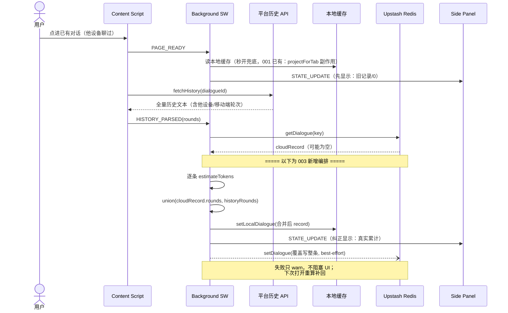

# 003: 跨设备对账引擎

## Status

union 对账引擎 + 增量上云 + 删除联动（本地 + 云端 DEL）+ 本地缓存 LRU 淘汰已实现，真机验收 pending。僵尸清理统一引擎已实现（定期 alarms + 首页触发，共享 5min 节流）；7 家 `fetchConversationList` 已实现；真机验收 pending。对账频率控制（P1）待实现。7 家拉历史 API 与删除端点已完成真机抓包（2026-06）。

**范围定位**：跨设备同步语义。把 [001](./001-headroom-core.md) 的估算能力 + [002](./002-upstash-data-layer.md) 的传输管道组合起来，让对话记录跨设备正确。

## Summary

**真值 = 平台历史的文本内容；token = 我们的估算**（001 引擎）。打开对话 → 从平台拉完整历史 → 逐条估 token → 与 Upstash 现有记录按**稳定 messageId** union 合并（位置 `n` 仅作显示序，合并后按时间重排） → **先在面板显示，再后台同步到 Redis**。平台服务器存历史文本，Upstash 是跨设备汇聚层，`browser.storage.local` 是加速缓存。增量拦截（001）在本 spec 里降级为"两次全量之间的即时反馈"。

四个同步动作（产品交互，以 DeepSeek 为例）：

| 动作               | 触发                       | 做什么                                                                       |
| ------------------ | -------------------------- | ---------------------------------------------------------------------------- |
| **A 僵尸清理**     | 打开平台首页、未进具体对话 | 后台拉对话列表 ↔ 对比 Upstash keys → 删差集（他设备/移动端删了但云没同步的） |
| **B 打开即对账**   | 点进某个具体对话           | 拉平台全量历史 → 逐条估 token → 与云记录 union 合并 → **先显示后同步**       |
| **C 实时增量上云** | 对话中、模型输出完毕       | 估本轮 input/output token → best-effort 上云                                 |
| **D 删除联动**     | 页面手动删对话             | 拦截删除请求 → 删 Upstash + 本地缓存                                         |

## Motivation

### 为什么不能只靠增量拦截

移动端聊的轮次，插件根本拦截不到——那些轮次不在我们的累加里。要"跨设备"名副其实，就得在用户**打开对话**时，从平台拉全量历史一次性算清。像微信：不打开收不到消息，但一打开历史全量同步。移动端聊的、别的设备聊的、断网期间丢的——全部在下次打开时自然纠正。

### 为什么 union 合并，不覆盖写

token 永远是从文本现估的，每次对账都把所有轮次重估一遍——只要"保留曾见过的所有轮次"即可。**union（by 稳定 messageId）**：平台每条消息/每轮都有一个**稳定身份**（DeepSeek `message_id`、ChatGPT mapping 节点 id、Kimi msg `id`、Qwen 对象 map 键、豆包 `index_in_conv`，均 2026-06 真机实测确认）。合并**按 messageId 配对**：平台还返回的轮以平台文本为准重估；平台不再返回的旧轮保留旧估算。

> **为什么不用位置 round-n 作合并 key**：位置 `n` 是"本次返回数组的下标"，不是稳定身份。当平台返回的轮集**变化**（截断、分页走取失败、单条删除、重生成移位）时，位置 `n` 整体漂移，把不同真实轮错配到同一 `n` → `totalTokens` 静默算错。实测复现（真实 `unionRounds`/`upsertRound`）：50 轮对话、设备 B 只拿到后 30 轮被重排成 `n=1..30`，合并后 `totalTokens` 算成 **1875 而非真实 1275**（后 20 轮重复计、前 20 轮丢失）。故 `n` 仅作**显示序**，合并后按时间重排分配；合并 key 必须是稳定 messageId。

> **截断的实际情况（2026-06 实测 7 平台）**：正常情况下**都不截断**——DeepSeek/Kimi/Qwen 一次返回全量；ChatGPT 返回整棵 mapping 树；豆包/通义千问分页但**走完全部页**。union"保留旧轮"的价值存在于边缘情形：超长会话撞分页上限（豆包/通义千问 50 页 cap）、分页走取中断、单条删除/重生成改变轮集。覆盖写在这些情形下会丢轮。

### 为什么不要 outbox / alarms drain

增量丢失（断网期间）的代价从"永久丢"降为"下次打开重算补回"。outbox + alarms drain 的复杂度换不来跨设备正确性（移动端绕过拦截才是真问题），全量对账才是根本解法。

## 用户交互场景（跨设备目标）

> 6 种用户交互（详见 [001](./001-headroom-core.md)「用户交互场景（本地层）」）在 001 已有本地行为；本节只标出**003 接线后哪些交互升级、升级成什么**。一张"交互 × 003 动作"矩阵，避免与 001 的本地描述各说各话。

| #   | 交互           | 001 本地行为（现状）                       | 003 升级（目标）                                                                        |
| --- | -------------- | ------------------------------------------ | --------------------------------------------------------------------------------------- |
| 1   | 打开平台主页   | IDLE 态                                    | **+僵尸清理（P1）**：`fetchConversationList` ↔ 对比 Upstash keys → 删差集（他设备删的） |
| 2   | 开启新对话首轮 | REPLACE 本地 record                        | 退化为 union（云记录为空，语义同 REPLACE）；新轮 best-effort 推云                       |
| 3   | 打开已有对话   | REPLACE 本地 record                        | **★核心：union 合并 + 先显示后同步**（见时序图）                                        |
| 4a  | 追加新一轮问答 | REPLACE 本地 record                        | 改 union；本地写完 best-effort 推整条 record 上云（失败 warn，下次打开补回）            |
| 4b  | 重新生成/停止  | REPLACE（轮数不变，第 N 轮 token 更新）    | union 天然处理：平台第 N 轮新文本重估覆盖旧估算，轮数不变                               |
| 5   | 删除对话       | `onBeforeRequest` + `parseDelete` → 删本地 | **+Upstash DEL**（best-effort）；移动端删走定期 alarm / 首页差集清理                    |

**矩阵读法**：标"—"或"退化"的交互，003 不改变其本地行为，只加 best-effort 推云；标"★核心"的交互3 是 003 存在的主要理由，其余是伴随的同步动作。

### 场景时序图 · 打开已有对话（交互3，003 核心升级）

对账一次 = 拉历史 → 逐条估 → union 合并 → **先显示后同步**。"先显示"用本地缓存/估算秒开仪表盘，不等网络；"后同步"后台 best-effort 推 Upstash，失败不阻塞。



**与 001 图 A 的关系**：001 图 A 是该流程的**单设备前身**（无 Upstash 参与，REPLACE 本地）。003 接线后保留两样、改一样、加一样：① `fetchHistory` 原语不变；②「读缓存先显示」001 已有（`projectForTab` 在 `PAGE_READY` 时读本地缓存并广播），003 沿用；③ 把 REPLACE 升级为 **union 合并**；④ 新增「后台 best-effort 推云」的后同步。**003 的真正新增是 union + 后同步，不是「先显示」**。

**保留**：

- **两层存储**：本地缓存（加速打开、离线仍可用）+ Upstash（跨设备汇聚）。职责不变。
- **删除联动**（拦截 + 存储效果）。
- **增量拦截保留**，但降级为"两次全量之间的即时反馈"（不再当真值来源）。

**新增**：

- **打开即全量对账（核心）**：content script `PAGE_READY` → background `fetchHistory` → 平台完整历史 → 逐条用 001 引擎估 token → union 合并 → 覆盖写本地缓存 + Upstash → 重投影仪表盘。
- **union 合并（by messageId）**：`getDialogue` → `union(cloudRounds, historyRounds)` → `setDialogue`。002 的 `setDialogue` 是纯覆盖写；合并编排在本 spec。
- **僵尸清理（统一引擎，两触发入口）**：定期 alarms(10min) + 打开首页 → 共享节流(5min) → `fetchConversationList` → 对比 Upstash keys → 删差集。
- **本地多对话缓存 + LRU 淘汰**。
- **产品边界声明**：Headroom 只精确记录"在装了扩展的设备上打开过"的对话。跨设备靠"打开即同步"——只要在任一装扩展的设备打开过，就全量同步；没在装扩展设备打开过的对话不在数据里。README/PRIVACY 如实声明。

**不采用**：outbox（增量丢失靠"下次打开重算"兜底，见上 Motivation）。**采用 `chrome.alarms` 仅用于僵尸清理调度**(10min 周期,非增量 drain)。仪表盘直接从缓存 record 派生（`projectUsage`），不另存运行态镜像。

## Requirements

### P0 — 核心

- [x] **打开即全量对账引擎**：`PAGE_READY` → `fetchHistory` → 逐条估 token → union 合并本地+Upstash → **先显示后同步**。
- [x] **union 合并语义（by messageId）**：平台有的轮以平台为准；平台不再返回的旧轮保留；`totalTokens`/`roundCount` 重算为合并后真实累计。
- [x] **本地多对话缓存**：`headroom:conv:{p}:{id}` 存最近一次对账/增量结果；仪表盘从缓存秒开（GET_STATE 投影）。LRU 淘汰见 P1。
- [x] **增量上云**：本轮历史落地后（`onCompleted` → `fetchHistory` → `applyHistory`）→ best-effort 推 Upstash（覆盖写整条）；失败只 warn，下次打开重算补回。
- [x] **删除联动（存储效果）**：webRequest 命中 `deleteUrl` → `parseDelete` 取 id → 删本地缓存 + Upstash `DEL`（best-effort）。
- [x] **仪表盘从本地缓存 record 派生**（`projectUsage`）：001 已落地，003 沿用。

### P1 — 增强

- [x] **僵尸清理（统一引擎）**：`chrome.alarms`(10min 周期) + 打开首页 → 共享节流(5min) → `fetchConversationList` → 对比 Upstash → 删差集。
- [ ] **对账频率控制**：快速切多个对话时 debounce / 只对停留 >N 秒的对话触发全量对账。
- [x] 7 家拉历史 API 验证（2026-06 真机抓包，全平台文本可取）。
- [x] 7 家删除端点实测（拦截层就绪）。

## Design

### Architecture

```
Side Panel (UI)  ↔ GET_STATE / STATE_UPDATE
Background (SW, 短命)
  ├─ 打开对话: PAGE_READY → fetchHistory → 全量对账 → union 合并 → 先显示后同步
  ├─ webRequest: send(+pending) / 删除(+DEL)   [即时反馈 / 网页删跟随]
  └─ 读: 本地缓存优先(秒开) → 后台对账纠正
       ↕                                    ↕ (best-effort 覆盖写)
  browser.storage.local ──────────────→ Upstash Redis KV
  (缓存 + 加速)                          (跨设备汇聚)
                                          ↑
                                  AI 平台服务器 (历史文本 = 真值)
```

### 本地 key

```
headroom:settings           → 全量含凭证 + updatedAt
headroom:conv:{p}:{id}      → DialogueRecord（最近一次对账/增量结果）
headroom:conv-index         → { <full-key>: updatedAt } 元数据（LRU 淘汰用，免全量扫描）
```

### union 合并（by messageId）

```
对账一次：
  cloudRecord  = getDialogue(key)                     // 可能为空
  historyRounds = fetchHistory(dialogueId)            // 平台全量历史，每轮带稳定 messageId
  newRounds = historyRounds.map(h => ({ messageId: h.messageId, ...估算(h) }))
  mergedRounds = union(cloudRecord.rounds, newRounds)  // by messageId：history 胜；cloud-only messageId 保留
  mergedRounds.sort(by 时间序).forEach((r,i)=> r.n = i+1)   // n 仅显示序，合并后按时间重排
  record = { ...cloudRecord,
             rounds: mergedRounds,
             totalTokens: Σ mergedRounds.total,        // 真实累计重算
             roundCount: mergedRounds.length,          // = 合并集中不同 messageId 的数量
             updatedAt: now }
```

- **平台还返回的轮** → 用平台文本重估，覆盖旧估算（平台是文本真值）。
- **平台不再返回的轮**（截断/分页遗漏）→ 保留 `cloudRecord` 里的旧估算，不丢。
- **`totalTokens` / `roundCount`** 从合并集重算：`totalTokens = Σ mergedRounds.total`；`roundCount = 合并集中不同 messageId 的数量`（稳定身份去重后计数，天然抗截断/抗重复）。两者均不受 `rounds[]` 裁剪影响（见 001 不变式）。

> **常态 = 全量覆盖写**：平台返回完整历史时，每一轮都以重估值胜出、云端旧值整体被替换——故系数升级（分词器换代 / 004 校准 / 用户覆盖）能被每次打开刷新，旧估算不会卡住。union 的"选择性"仅在平台**截断/分页**时体现：被丢的早期轮保留云端旧估算；代价是这些轮停留在当初那套系数上（`DialogueRecord` 只存计数不存文本，无文本则无法重估），收益是不丢这些轮的累计。DeepSeek 全量返回、无分页（见 001），此限制不存在。

**先显示后同步**（关键 UX）：对账算出 record → 立即写本地缓存 + 广播仪表盘（用户秒看到，不等网络）→ 后台 best-effort `setDialogue` 推 Upstash（失败只 warn，不阻塞 UI，下次打开补回）。

### 本地缓存淘汰（LRU）

引入本地多对话缓存后，`storage.local` 随使用增长。需要淘汰——但本地是**缓存不是真值**（Upstash 有完整记录，淘汰后可从云端重新拉取），所以淘汰是常规空间管理，不丢数据。

**配额实测（2026-06）**：

| 浏览器                        | `storage.local` 默认限额                  | 加 `unlimitedStorage` 后 |
| ----------------------------- | ----------------------------------------- | ------------------------ |
| Chrome / Edge（Chromium MV3） | ~10 MB（Chrome 113 前是 5MB）             | 解除                     |
| Firefox                       | 跟随 IndexedDB 配额（通常到可用磁盘 50%） | 解除                     |

单条 `DialogueRecord`：50 轮 ≈ 4 KB，满 200 轮 ≈ 16 KB（`RoundRecord` 只存 token 计数，不存文本）。10 MB 可缓存 ~2,500 个 50 轮对话 / ~600 个 200 轮对话，对个人用户够用。

**算法：LRU，按 `updatedAt` 排序淘汰**（`DialogueRecord.updatedAt` 每次写都刷新，天然就是 LRU 时间戳，零额外存储）。`conv-index` 存 `{ <full-key>: updatedAt }` 映射，避免全量 `storage.local.get(null)` 扫描。**触发**：本地总量超**软阈值 8 MB**（留 2 MB 给 settings）→ 按 `updatedAt` 升序删最旧（同步删 conv-index 项）→ 降到 **6 MB**（滞后区，避免频繁淘汰）。淘汰**只删本地**，不删 Upstash；下次打开该对话从云端重新拉取。

**不加 `unlimitedStorage` 权限**：多一个权限 = 商店审核多一项辩护 + 用户多一个授权提示 + reload 可能灰卡（见 `AGENTS.md`）；Firefox 上行为依赖磁盘配额，不保证持久。10 MB + LRU 对个人用户足够，且淘汰不丢真值。

### Data Flow

- **打开对话（B）**：`PAGE_READY` → `fetchHistory` → 逐条估 → union 合并 → 本地 SET + 广播仪表盘 → 后台 Upstash SET。
- **继续聊（C）**：`onCompleted` 拉到新轮并 `applyHistory` 落地后 → best-effort 推 Upstash（覆盖整条）；失败 warn，下次打开补回。
- **读用量**：`GET_STATE` → 读本地缓存 record → `projectUsage`（秒开）；后台对账完成后纠正。
- **网页端删对话（D）**：webRequest 命中 `deleteUrl` → `parseDelete` → 删本地缓存 + Upstash `DEL`（best-effort）。
- **移动端删对话**：下次打开首页或定期 alarm → `fetchConversationList` 差集清理。
- **僵尸清理（A）**：定期 alarms(10min) + 打开首页 → 共享节流(5min) → `fetchConversationList` → 对比 Upstash keys → 删差集。

### Adapter 字段归属（原语 vs 编排）

`fetchHistory` 容易误读为"003 专属"。实际它分两层，必须钉死：

- **原语（契约定义 + DeepSeek 实现）归 [001](./001-headroom-core.md)** —— 接口签名 `fetchHistory?(dialogueId) → HistoryRound[]`、DeepSeek 的逆向实现、`HistoryRound` 类型，都在 001 定义并已落地（`utils/platform-adapter.ts`、`adapters/deepseek.ts`）。001 的"打开/切对话/回答完成都拉历史 → REPLACE 本地 record"也用它。
- **编排（拉完历史后怎么合并）归 003** —— 001 用 REPLACE（历史即真值，单设备够用）；003 在原语之上加 **union 合并 + 先显示后同步**，让同样的拉历史动作获得跨设备能力。002 的 `setDialogue` 是纯覆盖写；"读云 record → union → 写"的编排是 003 的职责。

003 在 adapter 契约上**新增**的字段（原语层面仍归 001 定义，这里只标 003 使用）：

- **`fetchConversationList?() → string[]`**：拉对话 id 列表（僵尸清理用）。
- **`deleteUrl` / `parseDelete` / `deleteHost?` / `deleteMethod?`**：删除拦截的原语（001 已实现本地删除联动；003 在其上加 Upstash DEL，见删除场景）。

无 `fetchHistory` 的平台 → 003 对账跳过，退化为纯增量模式（该平台跨设备不覆盖）。

### 僵尸清理（统一引擎，两触发入口）

**问题**：对话已被删除（网页端手动删 / 移动端删 / 平台回收），但 Upstash 还留着对应的 `headroom:conv:{p}:{id}` key，占用存储且污染数据。

**设计原则**：两种触发场景（定期、首页）共享同一个清理引擎和节流逻辑，避免重复执行。

#### 清理引擎（平台无关）

```typescript
// background.ts

async function cleanupZombies(
  platformId: string,
  liveIds: string[],
): Promise<void> {
  // 1. 节流: <5min 前刚跑过则跳过
  const state = await getCleanupState();
  if (!shouldRunCleanup(state, platformId, Date.now())) return;

  // 2. SCAN Upstash 该平台的 key
  const cloudKeys = await kvScan(creds, `headroom:conv:${platformId}:*`);

  // 3. 算差集 → DEL
  const zombies = selectZombieKeys(cloudKeys, new Set(liveIds), platformId);
  await Promise.all(zombies.map((k) => kvDel(creds, k).catch(() => {})));

  // 4. 记录本次清理时间
  await setCleanupState(cleanupStateAfterRun(state, platformId, Date.now()));
}
```

#### 两触发入口

| 触发器            | 实现                                                              | 调用                                                                                      |
| ----------------- | ----------------------------------------------------------------- | ----------------------------------------------------------------------------------------- |
| **定期（10min）** | `chrome.alarms.create("zombie-cleanup", { periodInMinutes: 10 })` | `onAlarm` → 遍历 7 平台 → 有 tab 则发 `FETCH_CONVERSATION_LIST`；无 tab 则用缓存列表兜底  |
| **打开首页**      | content script 检测主页 URL（`dialogueIdFromUrl === null`）       | content script 主动发 `CONVERSATION_LIST` → background 调 `cleanupZombies(platform, ids)` |

#### 节流逻辑

```
任何批量触发(定期/首页) ──→ runZombieCleanup(platform)
                                │
                                ▼
                      检查 lastCleanupTime[platform]
                                │
                    ┌──── <5min? ────┐
                    │ YES            │ NO
                    ▼                ▼
                  跳过          执行清理
                                 │
                                 ▼
                          更新 lastCleanupTime
```

**为什么 5 分钟**：定期 10min + 首页触发可能同时发生 → 5min 节流保证最多执行一次。

#### 执行流程图

```
┌─────────────────────────────────────────────────────────────────┐
│                         触发层                                   │
│                                                                 │
│       chrome.alarms(10min)         CONVERSATION_LIST(首页)       │
│              │                            │                     │
│              ▼                            ▼                     │
│  ┌──────────────────────────────────────────────────────────┐   │
│  │            cleanupZombies(platform, liveIds)              │   │
│  │                                                          │   │
│  │  节流检查(5min) → kvScan → diff → kvDel → stamp 时间     │   │
│  └──────────────────────────────────────────────────────────┘   │
│              │                                                  │
│              ▼ (alarm 无 tab 时)                                │
│        用 lastConversationList 缓存兜底                         │
└─────────────────────────────────────────────────────────────────┘
```

#### 前置条件与降级

| 条件                             | 不满足时                         |
| -------------------------------- | -------------------------------- |
| 有打开的平台 tab                 | 定期清理跳过（无法拉活跃列表）   |
| 用户已登录平台                   | content script 拉不到列表 → 跳过 |
| Upstash 已配置                   | 只清本地（云端无东西可清）       |
| `fetchConversationList` 真机准确 | 清理效果打折扣（根本依赖）       |

#### 平台覆盖

| 平台                                               | `fetchConversationList` 方式 | 清理可靠性                              |
| -------------------------------------------------- | ---------------------------- | --------------------------------------- |
| DeepSeek / ChatGPT / Kimi / Qwen / 通义千问 / 豆包 | API 拉取                     | 高                                      |
| Gemini                                             | DOM 侧边栏抓取               | 低（虚拟化截断,只能清掉侧边栏不可见的） |

**Gemini 特殊处理**：DOM 抓取的 liveList 不完整 → 可能误判"侧边栏不可见的对话"为僵尸。缓解:Gemini 定期清理仅作为尽力而为,Gemini 用户若发现误清,下次打开该对话会自动从云端恢复(union 合并保留 cloud-only 轮)。

#### 存储

```typescript
// storage.local 新增
headroom:cleanup-state → { <platform>: lastCleanupTimestamp }
```

#### 权限

```json
// manifest.json
"permissions": ["alarms"]
```

### 7 平台拉历史 API（2026-06 真机抓包）

| 平台     | API                                                       | 文本可取                                                | 数据结构        | 服务端 token（仅校准参考）             |
| -------- | --------------------------------------------------------- | ------------------------------------------------------- | --------------- | -------------------------------------- |
| DeepSeek | `GET /api/v0/chat/history_messages?chat_session_id=`      | ✅ `fragments[].content`                                | 扁平 messages[] | ✅ `accumulated_token_usage`           |
| ChatGPT  | `GET /backend-api/conversation/<id>`                      | ✅ `mapping.{id}.message.content.parts[]`               | 树（mapping）   | ❌                                     |
| Gemini   | 内容在 SSR HTML / DOM                                     | ✅ DOM 可抓                                             | DOM             | ❌                                     |
| Kimi     | `POST /apiv2/...ChatService/ListMessages`                 | ✅ `messages[].blocks[].text.content`                   | 树（parentId）  | ❌                                     |
| Qwen     | `GET /api/v2/chats/<id>`                                  | ✅ `messages[].content` / `content_list[].content`      | map + 数组      | ✅ `content_list[].usage.total_tokens` |
| 通义千问 | `GET .../api/v1/session/msg/list?session_id=`（**分页**） | ✅ `request/response_messages[].content`                | 分页列表        | ✅ `extra_info...total_usage`          |
| 豆包     | `POST /im/chain/single`                                   | ✅ `messages[].content_block[].content.text_block.text` | 字节 IM 协议    | ❌                                     |

> **文本全部可取**——这是对账的前提（估 token 靠文本）。服务端 token 列仅作 [004](./004-optimizations.md) 校准参考，**不计入核心路径**（产品形态按"文本 → 估算"设计）。通义千问的分页需翻页取全。

> **稳定 messageId 来源（union 合并 key，2026-06 真机实测，7/7 全部确认）**：DeepSeek `message_id` · ChatGPT mapping 节点 id · Kimi msg `id` · Qwen(chat.qwen.ai) 对象 map 键 · 豆包 `index_in_conv` · 通义千问 `req_id`（逐轮请求 id，list 项字段）· Gemini turn wrapper `<div id>`（16 位 hex，跨 reload 稳定，与 Angular `_ngcontent-ng-c…` build 哈希无关）。order（显示序）：DeepSeek/豆包/通义千问用各自的 create_time/created_at，ChatGPT `create_time`，Kimi `createTime`，Qwen `timestamp`，Gemini DOM 序。适配器解析时大多已读到这些 id（配对/建树用）；旧实现发轮时丢弃改发位置 `n`——本变更改为透传 messageId 作合并 key。

### Browser APIs

`webRequest`（已有，send + 删除监听）。`fetchHistory` / `fetchConversationList` 用普通 `fetch`（同源，吃平台 cookie 会话）。`chrome.alarms`（僵尸清理定期调度,10min 周期,需 `alarms` 权限）。

## Implementation Plan

1. **纯逻辑（TDD）**：`union` 合并 + `projectUsage`；本地多对话缓存存取；LRU 淘汰（conv-index + 阈值判断）。
2. **fetchHistory 适配器**：先 DeepSeek（最简单，文本直接可取）作参考；再铺其余 6 家。ChatGPT 的 mapping 树遍历、Gemini 的 DOM 抓取、通义千问的分页是各自难点。
3. **打开即对账引擎**：`PAGE_READY` → `fetchHistory` → union → 先显示后同步。
4. **增量上云**：`applyHistory` 落地后覆盖写整条 + best-effort；失败 warn。
5. **删除联动**：`parseDelete` → 删本地缓存 + Upstash `DEL`。
6. **P1**：僵尸清理统一引擎（alarms 定期 + 首页触发,共享节流）、对账频率控制。

## Acceptance Criteria

- [x] 全新装、填凭证 → 打开一个已有对话 → 仪表盘从 0 爬升到真实累计（对账生效）
- [ ] **跨设备续聊**：设备 A 聊 5 轮 → 设备 B 打开同对话 → B 显示 5 轮累计（不是 0，不覆盖丢 A 的）
- [ ] **移动端轮次**：手机聊 3 轮 → 网页打开同对话 → 仪表盘含那 3 轮（平台历史里有，对账纳入）
- [ ] **断网不丢**：断网聊几轮（增量推失败 warn）→ 恢复后打开对话 → 对账补回（不需 outbox）
- [ ] **union 按稳定 messageId 合并**：平台返回的轮集变化（截断 / 单条删除 / 重生成移位）时，`totalTokens` 仍正确——不重复计、不丢早期轮（回归测试：50 轮截断到 30 轮 → `totalTokens` 不变；旧实现会算成 1875≠1275）
- [x] 网页端删对话 → 本地缓存 + Upstash 对应 key 都消失
- [x] 移动端删对话 → 下次首页打开或定期 alarm → Upstash 记录被差集清理
- [ ] **定期僵尸清理**：`chrome.alarms` 每 10min 触发 → 有平台 tab 时自动清理死 record；与首页触发共享 5min 节流
- [ ] 切 tab / 开面板读本地缓存（秒开），不阻塞网络

## Open Questions

- [ ] ChatGPT 的 mapping 树遍历：取主线（current_node 回溯）还是取所有 user→assistant 对？重生成分支怎么处理？
- [x] Gemini 历史内容抓取方式（2026-06 真机确认：内容在 SSR HTML / DOM，`fetchHistory` 走 DOM 抓取作兜底，文本可取；是否升级为更稳的 batchexecute RPC 留 [004](./004-optimizations.md)）。
- [ ] `fetchHistory` 的频率控制阈值：快速切对话时，debounce 多少 / 停留几秒才触发全量对账？
- [x] 僵尸清理触发频率：定期 alarms(10min) + 首页触发,共享 5min 节流（已设计）。
- [ ] 新会话首条无 dialogueId（Kimi 等）→ 首轮无法 fetchHistory；要等 dialogueId 出现。
- [ ] `MAX_RETAINED_ROUNDS`（200）在全量对账下是否仍合理？平台历史可能更长，对账要不要截断？
